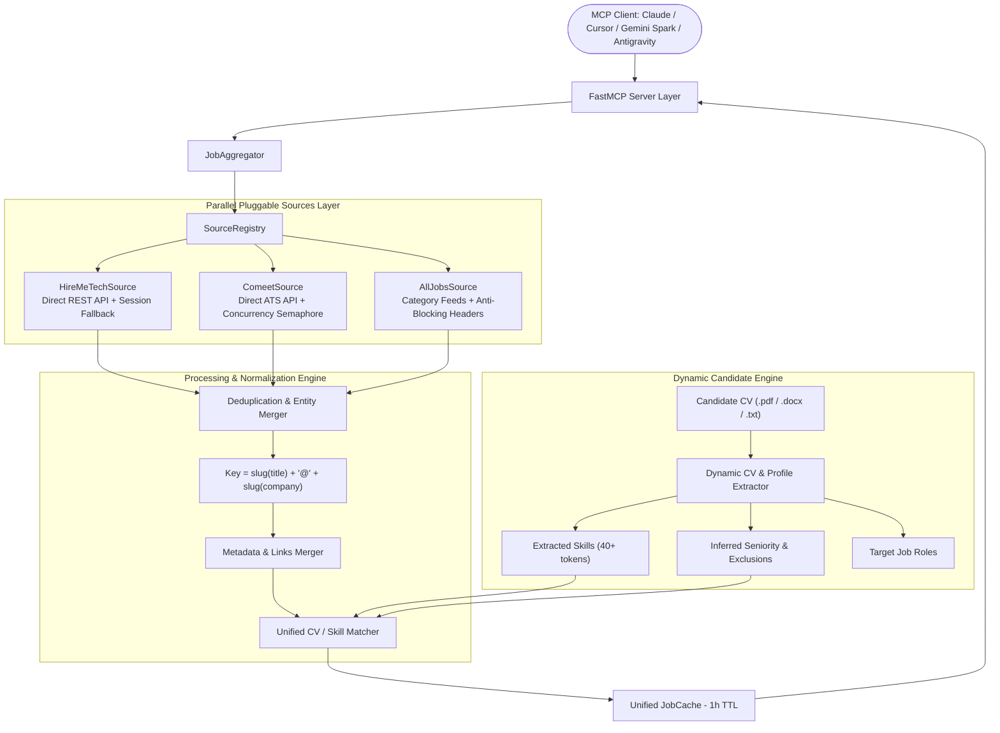

# Universal Multi-Source Job Search FastMCP Server (`job-mcp`)

[](https://www.python.org/downloads/)
[](https://github.com/jlowin/fastmcp)
[](tests/)
[](LICENSE)

An enterprise-grade, privacy-first **FastMCP** server providing intelligent, multi-source tech job aggregation, smart deduplication, dynamic CV skill extraction, requirement coverage scoring, and autonomous job application workflows across **HireMeTech**, **Comeet ATS**, and **AllJobs Israel**.

---

## Architecture Overview



---

## Key Features

1. **Dynamic CV & Candidate Profile Extraction**:
   - **Multi-Format Ingestion**: Supports `.pdf` (via `pypdf`), `.docx` (via `python-docx`), and `.txt` files.
   - **NLP Skill Chunking & Dynamic Lexicon**: Discovers and extracts 40+ technical skills without brittle hardcoding, supporting complex multi-word technologies (e.g., *FastAPI*, *LangGraph*, *PostgreSQL*, *Smart Contracts*, *GraphRAG*).
   - **Automatic Seniority & Exclusion Detection**: Accurately infers candidate seniority (Junior, Mid, Senior, Lead, Principal, Director) and generates intelligent negative keywords to filter out mismatched positions.
   - **Stopword & Noise Filtering**: Rigorously discards resume structural artifacts, dates, education titles, and non-technical metadata.

2. **Smart Requirement Coverage Scoring (0–100)**:
   - **Job Requirement Coverage Ratio**: Computes how comprehensively candidate skills satisfy the specific job's listed tech stack (`matched_job_skills / total_job_skills`), preventing penalty for candidates with broad resumes.
   - **Weighted Component Scoring**:
     - *Tech Stack Overlap & Coverage*: Up to 40 points
     - *Full CV Keyword Relevance*: Up to 25 points
     - *Work Mode & Location Alignment*: Up to 20 points
     - *Salary Expectations*: Up to 15 points
     - *Exclusion Penalty*: -100 points for hard seniority/tech disqualifiers.
   - **Tiered Match Categorization**:
     - **Top-Tier Match** ($\ge 85$): Auto-apply / prioritized application candidates.
     - **Strong Match** ($70 - 84$): High-interest listings flagged for review/bookmarking.
     - **Disqualified** ($< 50$): Automatically hidden or purged.

3. **Pluggable Multi-Source Architecture**:
   - **HireMeTech**: Direct REST API integration (`/api/jobs/search`, `/api/auth/me`, `/api/resume/profile`) with automated DOM fallback.
   - **Comeet (Direct ATS)**: Direct integration with Comeet Careers API (`/careers-api/2.0/company/{id}/positions`) with `asyncio.Semaphore(5)` rate-limiting, tech directory indexing, and per-company TTL caching.
   - **AllJobs Israel**: Category feed integration with realistic browser headers and source-level error isolation.

4. **Cross-Source Deduplication & Entity Merger**:
   - Eliminates duplicates when listings appear across multiple job boards.
   - Merges source lists (`sources: ["hiremetech", "comeet"]`), unions tech stacks, preserves richest description, and prioritizes direct ATS application links.

5. **Autonomous & Supervised Operation Modes**:
   - **Supervised Mode**: Standard MCP confirmation for each tool.
   - **Autonomous Mode**: Safe read/filter/bookmark chaining without manual prompts; two-stage safety barrier on application submission.

6. **Observability & Resilience**:
   - Structured JSON logging (`structlog`) writing to `stderr` with token/credential sanitization.
   - Automatic trace ID tracking across all `ToolResponse` payloads.

---

## Tool Reference (9 Tools)

| Tool Name | Parameters | Description |
|---|---|---|
| `list_job_sources` | *none* | Lists all registered job sources (`hiremetech`, `comeet`, `alljobs`), capabilities, and real-time health. |
| `get_job_matches` | `sources: list[str] = None`, `force_refresh: bool = False` | Fetches matched listings across all or specified platforms with deduplication. |
| `filter_jobs_by_preferences` | `tech_stack: list[str]`, `work_mode: str`, `location: str`, `min_salary: int`, `keywords: list[str]`, `exclude_keywords: list[str]`, `cv_path: str` | Scores and filters aggregated jobs against candidate CV and preferences. |
| `bookmark_job` | `job_id: str` | Saves/favorites a job listing on the originating platform. |
| `delete_job` | `job_id: str` | Dismisses/hides a job listing from view and removes it from cache. |
| `auto_apply_job` | `job_id: str` | **Step 1**: Inspects application modal, stages preview, reports warnings. |
| `confirm_auto_apply` | `job_id: str` | **Step 2**: Executes application submission. Always requires explicit confirmation. |
| `calibrate_selectors` | *none* | Discovers and calibrates DOM selectors against live pages with self-healing heuristics. |
| `set_operation_mode` | `mode: 'supervised' \| 'autonomous'` | Switches server execution mode between supervised and autonomous. |

---

## Quick Start & Setup

### 1. Clone & Install Dependencies

```bash
git clone https://github.com/zvieli/hireme_mcp.git
cd hireme_mcp

# Using uv (recommended)
uv venv .venv
uv pip install -e ".[dev]"
playwright install chromium
```

### 2. Configure Your Candidate Profile & CV

Place your resume (`cv.pdf`, `cv.docx`, or `cv.txt`) in the root directory:

```bash
cp /path/to/your/resume.pdf ./cv.pdf
cp .env.example .env
```

Edit `.env` to configure your default CV path and contact details:
```bash
DEFAULT_CV_PATH=./cv.pdf
CANDIDATE_EMAIL=your.email@example.com
CANDIDATE_NAME="Your Name"
```

### 3. (Optional) First-Time Authentication Setup for HireMeTech
*Comeet and AllJobs work automatically without login.* To authenticate your HireMeTech account for direct API access and auto-apply:

```bash
.venv/bin/python -m job_mcp.setup
```
1. A Chromium browser window will open.
2. Log in with your credentials.
3. Return to the terminal and press `[Enter]` to save the session to `./browser_profile`.

---

## Running the Server

### Option A: Using Docker (Recommended)

```bash
# Build and run in background
docker compose up -d

# View live multi-source aggregation logs
docker compose logs -f hireme-mcp
```

### Option B: Local Execution

```bash
# Streamable HTTP (Default for Web & Cloud Clients)
.venv/bin/python -m job_mcp --transport http --host 0.0.0.0 --port 8000

# Stdio (Default for Desktop Clients)
.venv/bin/python -m job_mcp --transport stdio
```

---

## Visual CLI Pipeline Runner

To run a full autonomous discovery, scoring, and application dry-run directly in your terminal with rich visual output:

```bash
# Run with auto-extracted skills from your CV:
.venv/bin/python scripts/run_mock_llm_pipeline.py --cv ./cv.pdf

# Run with explicit stack override and remote filter:
.venv/bin/python scripts/run_mock_llm_pipeline.py --cv ./cv.pdf --stack "Python,FastAPI,LangGraph" --work-mode remote --location "Tel Aviv"

# Execute live application submissions (disabled by default in dry-run):
.venv/bin/python scripts/run_mock_llm_pipeline.py --cv ./cv.pdf --auto-apply
```

---

## MCP Client Configuration

### 1. Claude Desktop (`claude_desktop_config.json`)

**On Linux:** `~/.config/Claude/claude_desktop_config.json`  
**On macOS:** `~/Library/Application Support/Claude/claude_desktop_config.json`  
**On Windows:** `%APPDATA%\Claude\claude_desktop_config.json`

```json
{
  "mcpServers": {
    "job-search-mcp": {
      "command": "/absolute/path/to/hireme_mcp/.venv/bin/python",
      "args": ["-m", "job_mcp", "--transport", "stdio"],
      "env": {
        "BROWSER_HEADLESS": "true",
        "DEFAULT_CV_PATH": "/absolute/path/to/hireme_mcp/cv.pdf",
        "CANDIDATE_EMAIL": "candidate@example.com",
        "LOG_LEVEL": "INFO"
      }
    }
  }
}
```

### 2. Gemini Spark / Web MCP Clients
- **Endpoint URL**: `https://<your-host-or-devtunnel-id>/mcp`
- **Transport**: `Streamable HTTP`
- **Authentication**: None / No Auth

---

## Environment Variables

| Variable | Default | Description |
|---|---|---|
| `DEFAULT_CV_PATH` | `./cv.pdf` | Default CV file path for dynamic candidate skill extraction. |
| `CANDIDATE_EMAIL` | `candidate@example.com` | Candidate email for automated application modals. |
| `CANDIDATE_NAME` | `""` | Candidate full name for application forms. |
| `MCP_TRANSPORT` | `http` | Transport protocol (`http`, `sse`, `stdio`). |
| `MCP_HOST` | `0.0.0.0` | Host binding for HTTP/SSE transport. |
| `MCP_PORT` | `8000` | Port for HTTP/SSE transport. |
| `BROWSER_HEADLESS` | `true` | Run browser in headless mode (`true`/`false`). |
| `BROWSER_PROFILE_DIR` | `./browser_profile` | Directory for persistent Chromium session storage. |
| `CACHE_TTL_MINUTES` | `60` | In-memory deduplicated job cache TTL in minutes. |
| `LOG_LEVEL` | `INFO` | Structured logging level (`DEBUG`, `INFO`, `WARNING`, `ERROR`). |

---

## Running Tests

Run the full automated test suite (542 tests):

```bash
.venv/bin/pytest tests/ -v
```

---

## License

This project is licensed under the MIT License.
