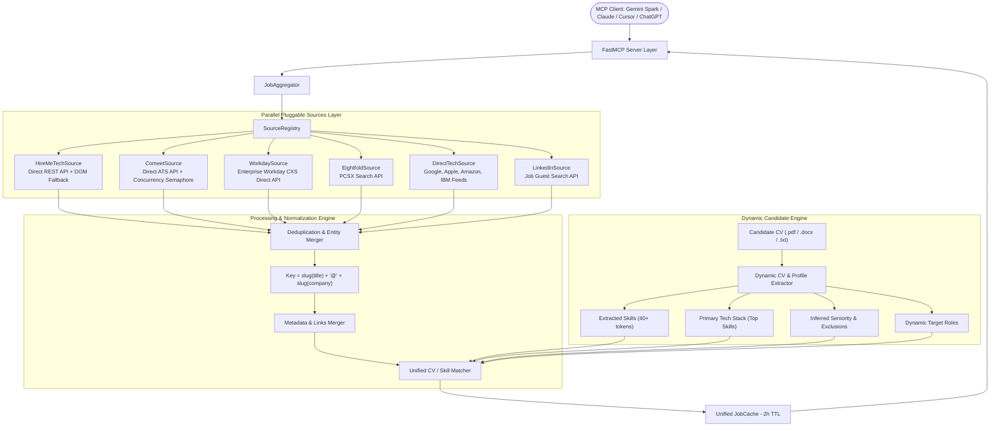

# Israeli Multi-Source Tech Job FastMCP Server (`TechJobMCP`)

[](https://www.python.org/downloads/)
[](https://github.com/jlowin/fastmcp)
[](tests/)
[](LICENSE)

An enterprise-grade, privacy-first **FastMCP** server providing intelligent, multi-source tech job aggregation, smart deduplication, dynamic CV skill & target role extraction, requirement coverage scoring, and autonomous job scouting workflows across **HireMeTech**, **Comeet ATS**, **Workday Enterprise**, **Eightfold.ai**, **DirectTech (Google, Apple, Amazon, IBM)**, and **LinkedIn**.

---

## Documentation Guides

- 📖 [**Setup & Candidate Profile Configuration Guide**](docs/SETUP_GUIDE.md) — Dynamic CV extraction, target roles, environment config, Docker & Python local run.
- 🌐 [**Cloudflare Tunnel & Port Export Guide**](docs/TUNNEL_AND_PORTS.md) — Exposing port 8000 via `cloudflared` for remote AI clients.
- 🤖 [**AI Client Integrations Guide**](docs/CLIENT_INTEGRATIONS.md) — Complete setup for **Gemini Spark** (autonomous scheduled scout), **Claude Desktop / CoWork**, **ChatGPT / Codex**, and **Cursor / Antigravity**.

---

## Architecture Overview



---

## Key Features

1. **Dynamic Candidate Extraction**:
   - Ingests `.pdf`, `.docx`, and `.txt` resumes for any engineering specialty (Java, Python, Frontend, DevOps, AI, Web3).
   - Automatically derives candidate `primary_stack` and `target_roles` without hardcoded assumptions.
   - Detects seniority level (Student, Junior, Mid, Senior, Lead) and generates tailored negative keywords.

2. **Calibrated Match Scoring (0–100)**:
   - **Primary Stack Affinity**: Heavily weights candidate's core technologies (+35 pts).
   - **Skill Volume Scaling**: Scales with absolute count of matched core competencies (4+ skills = 30 pts; 1 generic skill = 8 pts max).
   - **Target Role Semantic Fit**: Awards +15 pts for developer titles matching target roles; caps non-engineering/administrative positions at 65 pts.
   - **Commute & Location Normalization**: Normalizes country codes (`", IL"`, `Israel`, `ישראל`) and handles peripheral on-site roles.

3. **Autonomous Composite Scouting**:
   - `run_job_scout` executes multi-source aggregation, deduplication, scoring, bookmarking, and safe application previewing in a single call.
   - Structured JSON response with exact audit telemetry (`mcp_status`, `mcp_tracking_ids`, `submitted`, `bookmarked`, `removed_from_cache`, `summary_text`).

---

## Tool Reference (10 Tools)

| Tool Name | Parameters | Description |
|---|---|---|
| `run_job_scout` | `cv_path`, `location`, `top_tier_threshold`, `strong_match_threshold`, `disqualify_threshold`, `auto_bookmark`, `auto_apply`, `force_refresh` | **Composite Scout Tool**: Runs end-to-end aggregation, scoring, bookmarking, and reporting. |
| `list_job_sources` | *none* | Lists all registered job sources, capabilities, and real-time health. |
| `get_job_matches` | `sources: list[str] = None`, `force_refresh: bool = False` | Fetches matched listings across all or specified platforms with deduplication. |
| `filter_jobs_by_preferences` | `tech_stack`, `work_mode`, `location`, `min_salary`, `keywords`, `exclude_keywords`, `cv_path` | Scores and filters aggregated jobs against candidate CV and preferences. |
| `bookmark_job` | `job_id: str` | Saves/favorites a job listing on the originating platform. |
| `delete_job` | `job_id: str` | Dismisses/hides a job listing from view and removes it from cache. |
| `auto_apply_job` | `job_id: str` | **Step 1**: Inspects application modal, stages preview, reports warnings. |
| `confirm_auto_apply` | `job_id: str` | **Step 2**: Executes application submission. Always requires explicit confirmation. |
| `calibrate_selectors` | *none* | Discovers and calibrates DOM selectors against live pages with self-healing heuristics. |
| `set_operation_mode` | `mode: 'supervised' \| 'autonomous'` | Switches server execution mode between supervised and autonomous. |

---

## Quick Start

### 1. Clone & Configure
```bash
git clone https://github.com/zvieli/hireme_mcp.git
cd TechJobMCP

# Copy your CV and setup environment
cp /path/to/your/resume.pdf ./cv.pdf
cp .env.example .env
```

### 2. Run with Docker Compose
```bash
docker compose up -d
docker compose logs -f hireme-mcp
```

### 3. Export Public HTTPS Port for AI Clients
```bash
curl -L --output cloudflared https://github.com/cloudflare/cloudflared/releases/latest/download/cloudflared-linux-amd64
chmod +x cloudflared
./cloudflared tunnel --url http://localhost:8000
```

Connect the generated `https://<tunnel-id>.trycloudflare.com/mcp` URL to your AI client. See [**AI Client Integrations Guide**](docs/CLIENT_INTEGRATIONS.md) for full setup instructions.

---

## Running Tests

Run the full automated test suite (566 unit and integration tests):

```bash
uv run --extra dev pytest
```

---

## License

This project is licensed under the MIT License.
