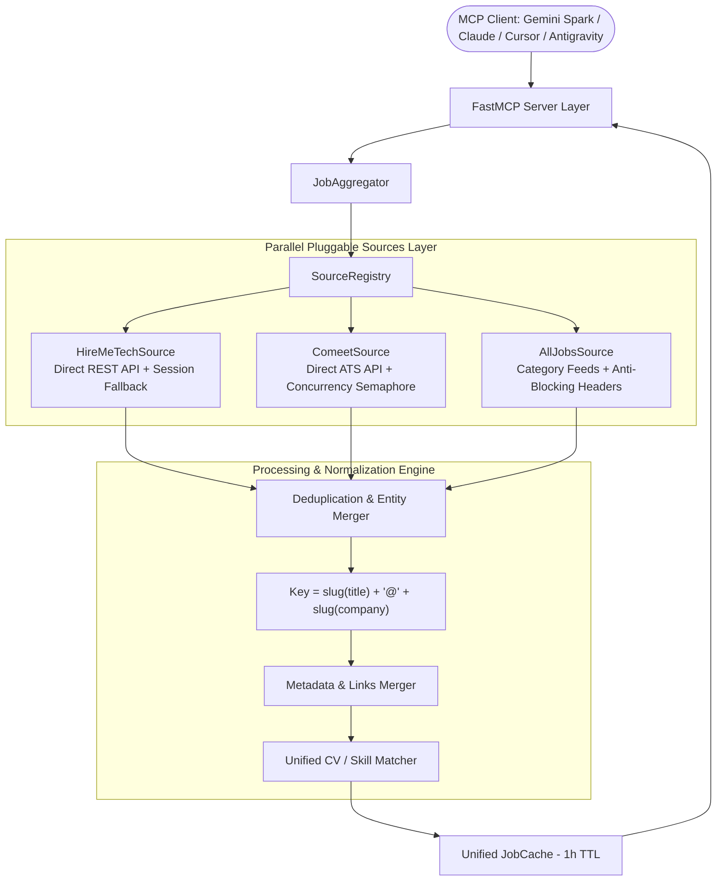

# Universal Multi-Source Job Search FastMCP Server (`job-mcp`)

[](https://www.python.org/downloads/)
[](https://github.com/jlowin/fastmcp)
[](tests/)
[](LICENSE)

An enterprise-grade **FastMCP** server providing intelligent, multi-source tech job aggregation, smart deduplication, CV keyword matching, and automated job applications across **HireMeTech**, **Comeet ATS**, and **AllJobs Israel**.

---

## Architecture Overview



---

## Key Features

1. **Pluggable Multi-Source Architecture**:
   - **HireMeTech**: Direct REST API integration (`/api/jobs/search`, `/api/auth/me`, `/api/resume/profile`) with automated DOM fallback.
   - **Comeet (Direct ATS)**: Direct integration with Comeet Careers API (`/careers-api/2.0/company/{id}/positions`) with `asyncio.Semaphore(5)` rate-limiting, top tech directory (Comm-IT and more), and per-company TTL caching.
   - **AllJobs Israel**: Israel's largest tech index integration with realistic browser headers and source-level error isolation.
2. **Cross-Source Deduplication & Entity Merger**:
   - Eliminates duplicate postings when companies post on multiple platforms.
   - Merges source lists (`sources: ["hiremetech", "comeet"]`), unions tech stacks, selects the richest description, and prioritizes direct ATS application links.
3. **Smart Job Matching & CV Scoring**:
   - Weighted scoring (0–100) based on tech stack overlap, work mode (`remote`/`hybrid`/`onsite`), location, salary, and CV extraction (`.pdf`, `.docx`, `.txt`).
4. **Autonomous & Supervised Operation Modes**:
   - **Supervised Mode**: Standard MCP confirmation for each tool.
   - **Autonomous Mode**: Safe read/filter/bookmark chaining without manual prompts; safety barrier on application submission.
5. **Observability & Resilience**:
   - Structured JSON logging (`structlog`) writing to `stderr` with secret/token sanitization.
   - Automatic trace ID tracking across all `ToolResponse` payloads.

---

## Tool Reference (9 Tools)

| Tool Name | Parameters | Description |
|---|---|---|
| `list_job_sources` | *none* | Lists all registered job sources (`hiremetech`, `comeet`, `alljobs`), capabilities, and real-time health. |
| `get_job_matches` | `sources: list[str] = None`, `force_refresh: bool = False` | Fetches matched listings across all or specified platforms with deduplication. |
| `filter_jobs_by_preferences` | `tech_stack: list[str]`, `work_mode: str`, `location: str`, `min_salary: int`, `keywords: list[str]`, `exclude_keywords: list[str]`, `cv_path: str` | Scores and filters aggregated jobs against CV and preference parameters. |
| `bookmark_job` | `job_id: str` | Saves/favorites a job listing on the originating platform. |
| `delete_job` | `job_id: str` | Dismisses/hides a job listing from view and removes it from cache. |
| `auto_apply_job` | `job_id: str` | **Step 1**: Inspects application modal, stages preview, reports warnings. |
| `confirm_auto_apply` | `job_id: str` | **Step 2**: Executes application submission. Always requires explicit confirmation. |
| `calibrate_selectors` | *none* | Discovers and calibrates DOM selectors against live pages with self-healing heuristics. |
| `set_operation_mode` | `mode: 'supervised' \| 'autonomous'` | Switches server execution mode. |

---

## Quick Start & Setup

### 1. Clone & Install Dependencies

```bash
git clone https://github.com/zvieli/hireme_mcp.git
cd hireme_mcp

# Using uv (recommended)
uv venv .venv
uv pip install -e ".[dev]"
playwright install chromium
```

### 2. (Optional) First-Time Authentication Setup for HireMeTech
*Comeet and AllJobs work automatically without login.* To authenticate your HireMeTech account for direct API access and auto-apply:

```bash
.venv/bin/python -m job_mcp.setup
```
1. A Chromium browser window will open.
2. Log in with your credentials.
3. Return to the terminal and press `[Enter]` to save the session to `~/.hireme_mcp/browser_profile`.

---

## Running the Server

### Option A: Using Docker (Recommended)

```bash
# Build and run in background
docker compose up -d

# View live multi-source aggregation logs
docker compose logs -f hireme-mcp
```

### Option B: Local Execution

```bash
# Streamable HTTP (Default for Web & Cloud Clients)
.venv/bin/python -m job_mcp --transport http --host 0.0.0.0 --port 8000

# Stdio (Default for Desktop Clients)
.venv/bin/python -m job_mcp --transport stdio
```

---

## MCP Client Configuration

### 1. Gemini Spark (Google Custom MCP Server)
- **Endpoint URL**: `https://<your-devtunnel-id>.devtunnels.ms/mcp`
- **Transport**: `Streamable HTTP`
- **Authentication**: None / No Auth

### 2. Claude Desktop (`claude_desktop_config.json`)

**On Linux:** `~/.config/Claude/claude_desktop_config.json`  
**On macOS:** `~/Library/Application Support/Claude/claude_desktop_config.json`  
**On Windows:** `%APPDATA%\Claude\claude_desktop_config.json`

```json
{
  "mcpServers": {
    "job-search-mcp": {
      "command": "/home/lior/data/projects/hireme_mcp/.venv/bin/python",
      "args": ["-m", "job_mcp", "--transport", "stdio"],
      "env": {
        "BROWSER_HEADLESS": "true",
        "DEFAULT_CV_PATH": "/home/lior/data/projects/hireme_mcp/lior_zvieli_cv.pdf",
        "LOG_LEVEL": "INFO"
      }
    }
  }
}
```

---

## Environment Variables

| Variable | Default | Description |
|---|---|---|
| `MCP_TRANSPORT` | `http` | Transport protocol (`http`, `sse`, `stdio`). |
| `MCP_HOST` | `0.0.0.0` | Host binding for HTTP/SSE transport. |
| `MCP_PORT` | `8000` | Port for HTTP/SSE transport. |
| `BROWSER_HEADLESS` | `true` | Run browser in headless mode (`true`/`false`). |
| `BROWSER_PROFILE_DIR` | `/app/browser_profile` | Directory for persistent Chromium storage. |
| `DEFAULT_CV_PATH` | `/app/cv.pdf` | Default CV file path for automatic skill matching. |
| `CACHE_TTL_MINUTES` | `60` | In-memory cache TTL in minutes. |
| `LOG_LEVEL` | `INFO` | Structured logging level (`DEBUG`, `INFO`, `WARNING`, `ERROR`). |

---

## Running Tests

Run the full automated test suite (239 tests):

```bash
.venv/bin/pytest tests/ -v
```

---

## License

This project is licensed under the MIT License.
