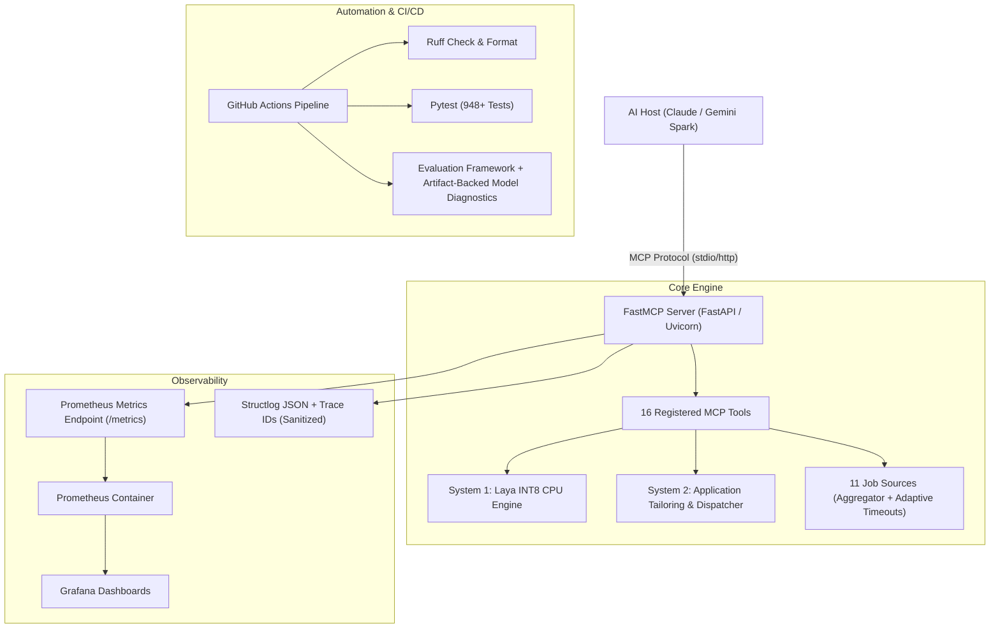

# Master Specification: TechJobMCP Production Enhancement
**Architecture & Implementation Blueprint for Multi-Agent Collaboration (AGY, Freebuff, Pi)**

---

## 1. Context & Purpose
TechJobMCP is an asynchronous Model Context Protocol (MCP) server providing 16 autonomous tools to LLM hosts (Claude, Gemini Spark) for Israeli tech job ingestion, System 1 neural triage (fine-tuned Laya multilingual INT8 on CPU), and System 2 application dispatching across 11 ATS platforms[cite: 5, 8].

### Core Objective:
Elevate TechJobMCP from a locally functioning prototype to an **Industry-Grade, Auditable Production System** that definitively closes all AI/Backend Engineering CV gaps, without unnecessary frontend bloat[cite: 8].

---

## 2. Multi-Agent Operational Rules (Strict Invariants)

All collaborating agents (AGY, Freebuff, Pi, Claude Code, Cursor) must adhere to the following rules[cite: 8]:

1. **Do NOT Break Existing Tests:**
   - TechJobMCP has **948+ tests across the repository**[cite: 5].
   - Any commit or task execution MUST ensure `uv run pytest tests/` continues to pass with zero regressions[cite: 5, 8].
2. **Package & Dependency Management:**
   - The project strictly uses `uv` with `pyproject.toml` and `uv.lock`[cite: 8].
   - Never run raw `pip install`. Use `uv add` or `uv sync`[cite: 8].
3. **No Unnecessary Frontends / Dashboards:**
   - TechJobMCP is a Headless MCP Server. The client is an AI agent (Gemini Spark / Claude)[cite: 8].
   - Do NOT introduce web UIs, React apps, or frontend scaffolding[cite: 8].
4. **Zero-Cost Local & CI Execution:**
   - All tests and benchmarks must be runnable locally on CPU without requiring paid external API calls (use existing mocks and cached holdouts)[cite: 8].
   - Docker Compose must support single-command local spin-up[cite: 8].

---

## 3. Architecture Target State



---

## 4. Work Breakdown & Milestones (Specs)

### Milestone 1: Automated CI/CD & Evaluation Gates — COMPLETE

**Completion date:** 2026-09-26  
**Implementation history:** see Git history  
**Independent review:** GPT-5.6 Sol — `Merge verdict: OK`

**Verified implementation state:** Full suite: **951 passed, 2 xfailed**. Artifact-free evaluation plumbing: **5 passed, 5 skipped**. Local real-model evaluation: **8 passed, 2 xfailed**. Scoped Milestone-1 Ruff gate: **PASS**.

PR CI validates the full test suite, scoped Milestone-1 linting, and **Evaluation Framework / Plumbing Tests**. It does not download ignored Laya artifacts and does not claim real-model validation. Repository-wide Ruff findings are recorded as non-blocking technical debt, not represented as green. A pinned artifact-backed real-model regression workflow is **DEFERRED**.

#### 1.1 Evaluation Framework / Plumbing Tests [COMPLETE]

* **Target File:** `tests/evaluation/test_evaluation_gates.py`
* **Specification:**
* Before configuring the CI workflow, construct this test file.
* Artifact-independent tests cover metric plumbing, ordered match-scoring reconstruction, production seniority score capping, and complete fallback detection; they execute in clean PR CI.
* Artifact-backed diagnostics load holdout samples from `data/holdout/laya_val.jsonl` and `LazyLayaEngine` only when both ignored artifacts are locally available. Missing artifacts skip only those diagnostics.


* Real-model targets are reported honestly, not treated as passing PR-CI gates:
1. Expected Calibration Error (ECE) target $\le 3.5\%$ is currently **not met**.
2. Seniority mismatch detection accuracy target $\ge 90\%$ is currently **not met**.
3. CPU latency is measured as a regression metric. The $< 30\text{ms}$ per-pair target is **not** an accepted hard gate pending a reproducible benchmark protocol.


#### 1.2 GitHub Actions Pipeline

* **Target File:** `.github/workflows/ci.yml`
* **Specification:**
* Trigger on: `push` to `main`, `pull_request` to `main`.


* Runner: `ubuntu-latest`.


* Toolchain: Python 3.12+ via `astral-sh/setup-uv@v4`.


* **Mandatory Optimization (CPU Wheels):** Prevent downloading multi-gigabyte CUDA wheels by explicitly binding PyTorch CPU index.
* Steps:
1. Checkout repository with full history.


2. Cache uv environment (`enable-cache: true`).
3. Install dependencies with CPU PyTorch:
```bash
uv sync --extra dev --extra ml --extra training --find-links [https://download.pytorch.org/whl/cpu](https://download.pytorch.org/whl/cpu)

```


4. Install Playwright browser binary and system dependencies:
```bash
uv run playwright install --with-deps chromium

```


5. Scoped Milestone-1 code-quality check (repository-wide Ruff debt is non-blocking and recorded separately):
```bash
uv run ruff check tests/evaluation/test_evaluation_gates.py tests/conftest.py tests/test_cli_runner.py

```


6. Full Test Suite:
```bash
uv run pytest tests/ -v --tb=short

```


7. Evaluation Framework / Plumbing Tests:
```bash
uv run pytest tests/evaluation/test_evaluation_gates.py -v

```

This artifact-free PR-CI step does not claim a real-model evaluation. A pinned artifact-backed regression workflow remains deferred.


* **Verification Gate:**
* Locally verify the scoped Ruff command and run the test suite end-to-end. Do not treat artifact-free CI as proof that real-model quality targets pass.


---

### Milestone 2: Enterprise Observability & Telemetry

#### 2.1 Prometheus Metrics Instrumentation

* **Target File:** `job_mcp/utils/metrics.py`

* **Specification:**
* Define Prometheus counters and histograms using `prometheus_client`:
* `mcp_tool_execution_duration_seconds`: Histogram with buckets `[0.05, 0.1, 0.25, 0.5, 1.0, 2.5, 5.0, 10.0, 15.0]`, labeled by `tool_name` and `status` (`success`, `error`).


* `mcp_system1_triage_total`: Counter labeled by `decision` (`local_accept`, `escalate_system2`, `disqualified`).


* `mcp_source_fetch_duration_seconds`: Histogram labeled by `source_name`.


* `mcp_estimated_cost_saved_usd`: Counter tracking cumulative cost avoided via local System 1 triage.


* Provide a timing decorator `@track_tool_metrics("tool_name")`.


#### 2.2 Endpoint Exposure & FastMCP Middleware Isolation

* **Target File:** `job_mcp/main.py`

* **Specification:**
* Expose `/metrics` using `prometheus_client.make_asgi_app()`.
* **Crucial Rule:** In `GeminiProbeMiddleware`, explicitly bypass the `/metrics` path. It must NEVER be subject to session ID checks, SSE stream headers, or client probe responses.


#### 2.3 Prometheus & Grafana Docker Infrastructure

* **Target Files:**
* `docker-compose.yml`

* `deploy/prometheus/prometheus.yml`

* `deploy/grafana/provisioning/datasources/datasource.yml`
* `deploy/grafana/provisioning/dashboards/dashboard_provider.yml`
* `deploy/grafana/dashboards/techjob_overview.json`


* **Specification:**
* Prometheus configured with a 5-second scrape interval targeting `techjob-mcp:8000`.
* Grafana provisioned automatically with a Prometheus datasource and a clean, valid dashboard JSON displaying:
* MCP Tool execution latency (P95 / P99).
* System 1 Triage Ratio (%) vs System 2 Escalations.
* Source Latency Heatmap (Comeet, Greenhouse, Lever, etc.).
* Estimated LLM API cost savings.


---

### Milestone 3: Model Evaluation Artifacts & Benchmark Report

* **Target Files:**
* `docs/BENCHMARKS.md`


* **Specification:**
* Formalize an empirical report that publishes only metrics reproduced by the benchmark harness:
1. **Dual-Engine Architecture Latency:** Reproduce cold and warm end-to-end latency under a documented benchmark protocol; treat prior figures as historical claims until reproduced.
2. **Local INT8 Quantization:** Measure throughput, latency, and memory under fixed hardware and software conditions; do not claim a latency target before measurement.
3. **Calibration & Reliability:** Reconcile training/calibration metadata with current end-to-end ECE and seniority-mismatch measurements. Document only reproduced holdout results.

* Provide exact CLI reproduction commands and the benchmark environment definition.


---

### Milestone 4: Docker Compose Verification & Healthcheck

* **Target Files:**
* `docker-compose.yml`


* **Specification:**
* Ensure all 3 services (`techjob-mcp`, `prometheus`, `grafana`) connect over an internal Docker network.


* `techjob-mcp` maintains its internal environment configuration:
* `SOURCE_TIMEOUT_SECONDS=15.0`

* `ENABLE_INT8_QUANTIZATION=true`

* `MAX_NEURAL_EVAL=15`

* `TORCH_NUM_THREADS=4`


* **Verification Gate:**
* Execute `docker compose config` to verify syntax and volume mounts.


---

## 5. Agent Verification Checklist (Definition of Done)

Before any agent marks a milestone or task as complete, it MUST verify:

* [ ] `uv run pytest tests/` passes 100% (all 948+ tests passing).


* [ ] For Milestone 1 PR CI, artifact-free evaluation/plumbing tests pass; artifact-backed real-model diagnostics are separately reported or explicitly skipped when artifacts are unavailable.
* [ ] For Milestone 1 PR CI, the scoped Milestone-1 Ruff gate passes. Record repository-wide Ruff debt separately; do not represent it as green.


* [ ] `/metrics` endpoint is isolated and does not interfere with FastMCP SSE or Gemini probe requests.


* [ ] `docker compose config` evaluates without warnings or schema errors.


* [ ] Git commit message follows Conventional Commits format (`ci:`, `feat:`, `fix:`, `docs:`).

