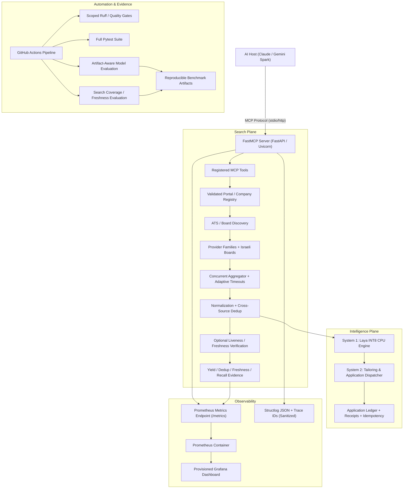

# Master Specification: TechJobMCP Production Enhancement
**Architecture, Production Hardening & Search-Quality Blueprint for Multi-Agent Collaboration (AGY, Freebuff, Pi)**

---

## 1. Context & Purpose
TechJobMCP is an asynchronous Model Context Protocol (MCP) server providing 16 autonomous tools to LLM hosts (Claude, Gemini Spark) for Israeli tech job ingestion, System 1 neural triage (fine-tuned Laya multilingual INT8 on CPU), and System 2 application dispatching across 11 current job-source/provider families.

### Core Objective:
Elevate TechJobMCP from a locally functioning prototype to an **Industry-Grade, Auditable, Search-Extensible and Evidence-Backed Production System** that demonstrates strong AI/Backend Engineering capability without unnecessary frontend bloat.

The target system must succeed on three independent axes:

1. **Production-grade:** deterministic CI, observability, reproducible benchmarks, safe deployment, and auditable application behavior.
2. **Search-extensible:** coverage must not be constrained to hardcoded company registries; supported ATS families must be extensible through configuration and discovery.
3. **Evidence-backed:** claims about model quality, search coverage, freshness, latency, reliability, and production readiness must be reproducible and publicly supportable.

### Research-Derived Strategic Findings
A read-only competitive and repository audit identified the following architectural constraints that were not fully represented in the original specification:

* The current source layer mixes whole-board, query-driven, and company-registry-driven providers. Several provider families still depend on hardcoded Python company registries.
* The aggregation, normalization, deduplication, adaptive-timeout, observability, and fail-closed application layers are stronger than the current breadth of the discovery universe.
* Adding an arbitrary company should become a configuration operation rather than a Python source-code change.
* Search coverage and search freshness are distinct quality dimensions. A broader discovery universe must not be treated as successful if stale or dead postings increase proportionally.
* Search quality itself requires measurable evidence: provider yield, deduplication rate, staleness/liveness rate, and golden-set recall.
* Productization and public evidence are part of production readiness. A technically strong local checkout is insufficient if installation, licensing, release metadata, reproducibility, and benchmark evidence are missing.
* TechJobMCP remains a **headless MCP system**. Competitor lifecycle features, dashboards, TUI/web frontends, negotiation suites, and unrelated job-search assistants are explicitly outside the core scope unless separately justified.

---

## 2. Multi-Agent Operational Rules (Strict Invariants)

All collaborating agents (AGY, Freebuff, Pi, Claude Code, Cursor) must adhere to the following rules:

1. **Do NOT Break Existing Tests:**
   - The exact repository test count is informational and evolves by milestone; it is not a contractual constant.
   - Any implementation commit MUST ensure `uv run pytest tests/` passes with zero regressions except explicitly documented expected xfails/skips.
   - Agents MUST NOT update documentation merely to match a failing test count; the test suite is the source of truth.

2. **Package & Dependency Management:**
   - The project strictly uses `uv` with `pyproject.toml` and `uv.lock`.
   - Never run raw `pip install`. Use `uv add`, `uv remove`, or `uv sync` only when dependency mutation is explicitly in scope.
   - Reproducibility policy for `uv.lock` is part of Milestone 8 and must be resolved explicitly rather than left implicit.

3. **No Unnecessary Frontends / Dashboards:**
   - TechJobMCP is a Headless MCP Server. The client is an AI host/agent.
   - Do NOT introduce web UIs, React apps, TUI dashboards, or frontend scaffolding as part of the production-enhancement roadmap.
   - Prometheus/Grafana observability remains operational infrastructure, not a product UI.

4. **Zero-Cost Local & CI Execution:**
   - All tests and benchmark validation paths must be runnable locally on CPU without requiring paid external API calls.
   - Use mocks, cached fixtures, deterministic holdouts, and public/zero-cost provider endpoints where practical.
   - Docker Compose must support single-command local spin-up.

5. **Search Coverage Must Be Configuration-Driven:**
   - Adding a supported ATS company MUST NOT require editing provider implementation code once that ATS family is supported.
   - Built-in curated defaults may exist, but user/project overrides must be loaded from a validated configuration layer.

6. **Search Coverage and Freshness Are Separate Gates:**
   - Provider breadth, job discovery recall, liveness, staleness, and repost history MUST be measured independently.
   - A provider is not considered production-ready merely because it returns results.

7. **Evidence Before Claims:**
   - Performance, quality, search-recall, freshness, and reliability claims MUST be backed by reproducible artifacts or benchmark procedures.
   - Historical or unreproduced figures must be labeled as such.

8. **No Competitor-Driven Scope Creep:**
   - Do NOT add interview coaching, negotiation, contract analysis, generalized career advice, community/plugin ecosystems, or unrelated lifecycle features unless a future specification explicitly establishes product and portfolio value.

---

## 3. Architecture Target State


```mermaid
flowchart TD
    Client["AI Host (Claude / Gemini Spark)"] -->|"MCP Protocol (stdio/http)"| Server["FastMCP Server (FastAPI / Uvicorn)"]

    subgraph Search Plane
        Server --> Tools["Registered MCP Tools"]
        Tools --> Registry["Validated Portal / Company Registry"]
        Registry --> Discovery["ATS / Board Discovery"]
        Discovery --> Sources["Provider Families + Israeli Boards"]
        Sources --> Aggregator["Concurrent Aggregator + Adaptive Timeouts"]
        Aggregator --> Normalize["Normalization + Cross-Source Dedup"]
        Normalize --> Verify["Optional Liveness / Freshness Verification"]
        Verify --> SearchMetrics["Yield / Dedup / Freshness / Recall Evidence"]
    end

    subgraph Intelligence Plane
        Normalize --> S1["System 1: Laya INT8 CPU Engine"]
        S1 --> S2["System 2: Tailoring & Application Dispatcher"]
        S2 --> Ledger["Application Ledger + Receipts + Idempotency"]
    end

    subgraph Observability
        Server --> Metrics["Prometheus Metrics Endpoint (/metrics)"]
        Server --> Logs["Structlog JSON + Trace IDs (Sanitized)"]
        SearchMetrics --> Metrics
        Metrics --> Prom["Prometheus Container"]
        Prom --> Grafana["Provisioned Grafana Dashboard"]
    end

    subgraph Automation & Evidence
        GH["GitHub Actions Pipeline"]
        GH --> Lint["Scoped Ruff / Quality Gates"]
        GH --> UnitTests["Full Pytest Suite"]
        GH --> EvalGate["Artifact-Aware Model Evaluation"]
        GH --> SearchEval["Search Coverage / Freshness Evaluation"]
        EvalGate --> BenchDocs["Reproducible Benchmark Artifacts"]
        SearchEval --> BenchDocs
    end
```

### Architectural Boundaries

* **Registry** owns user-editable company/portal configuration and validation. It does not contain scraping logic.
* **Discovery** resolves company names / career URLs into provider-compatible identifiers where possible. It does not perform ranking. Discovery may consume existing registry context, but its resolved output is reviewable data that can be persisted back as registry entries; the diagram arrow is a processing-flow simplification, not ownership direction.
* **Providers** fetch raw postings for known provider families. They remain isolated behind existing source abstractions.
* **Aggregator** owns concurrency, timeout policy, source isolation, normalization handoff, and unified result collection.
* **Verification** is an optional post-fetch stage for liveness/freshness; it must not silently mutate provider semantics.
* **System 1 / System 2** consume normalized job objects. Search-expansion work must not change model semantics unless separately specified.
* **Search evaluation** measures discovery quality separately from model-ranking quality.

---

## 4. Work Breakdown & Milestones (Specs)

### Milestone 1: Automated CI/CD & Evaluation Gates — COMPLETE

**Completion date:** 2026-09-26  
**Implementation history:** see Git history  
**Independent review:** GPT-5.6 Sol — `Merge verdict: OK`

**Verified implementation state:** Full suite: **951 passed, 2 xfailed**. Artifact-free evaluation plumbing: **5 passed, 5 skipped**. Local real-model evaluation: **8 passed, 2 xfailed**. Scoped Milestone-1 Ruff gate: **PASS**.

PR CI validates the full test suite, scoped Milestone-1 linting, and **Evaluation Framework / Plumbing Tests**. It does not download ignored Laya artifacts and does not claim real-model validation. Repository-wide Ruff findings are recorded as non-blocking technical debt, not represented as green. A pinned artifact-backed real-model regression workflow is **DEFERRED**.

#### 1.1 Evaluation Framework / Plumbing Tests [COMPLETE]

* **Target File:** `tests/evaluation/test_evaluation_gates.py`
* **Specification:**
* Before configuring the CI workflow, construct this test file.
* Artifact-independent tests cover metric plumbing, ordered match-scoring reconstruction, production seniority score capping, and complete fallback detection; they execute in clean PR CI.
* Artifact-backed diagnostics load holdout samples from `data/holdout/laya_val.jsonl` and `LazyLayaEngine` only when both ignored artifacts are locally available. Missing artifacts skip only those diagnostics.


* Real-model targets are reported honestly, not treated as passing PR-CI gates:
1. Expected Calibration Error (ECE) target $\le 3.5\%$ is currently **not met**.
2. Seniority mismatch detection accuracy target $\ge 90\%$ is currently **not met**.
3. CPU latency is measured as a regression metric. The $< 30\text{ms}$ per-pair target is **not** an accepted hard gate pending a reproducible benchmark protocol.


#### 1.2 GitHub Actions Pipeline

* **Target File:** `.github/workflows/ci.yml`
* **Specification:**
* Trigger on: `push` to `main`, `pull_request` to `main`.


* Runner: `ubuntu-latest`.


* Toolchain: Python 3.12+ via `astral-sh/setup-uv@v4`.


* **Mandatory Optimization (CPU Wheels):** Prevent downloading multi-gigabyte CUDA wheels by explicitly binding PyTorch CPU index.
* Steps:
1. Checkout repository with full history.


2. Cache uv environment (`enable-cache: true`).
3. Install dependencies with CPU PyTorch:
```bash
uv sync --extra dev --extra ml --extra training --find-links [https://download.pytorch.org/whl/cpu](https://download.pytorch.org/whl/cpu)

```


4. Install Playwright browser binary and system dependencies:
```bash
uv run playwright install --with-deps chromium

```


5. Scoped Milestone-1 code-quality check (repository-wide Ruff debt is non-blocking and recorded separately):
```bash
uv run ruff check tests/evaluation/test_evaluation_gates.py tests/conftest.py tests/test_cli_runner.py

```


6. Full Test Suite:
```bash
uv run pytest tests/ -v --tb=short

```


7. Evaluation Framework / Plumbing Tests:
```bash
uv run pytest tests/evaluation/test_evaluation_gates.py -v

```

This artifact-free PR-CI step does not claim a real-model evaluation. A pinned artifact-backed regression workflow remains deferred.


* **Verification Gate:**
* Locally verify the scoped Ruff command and run the test suite end-to-end. Do not treat artifact-free CI as proof that real-model quality targets pass.


---

### Milestone 2: Enterprise Observability & Telemetry — COMPLETE

**Completion date:** 2026-09-26
**Independent review:** GPT-5.6 Sol — `Merge verdict: OK`

**Verified implementation state:**

* `ToolMetricsMiddleware` centralizes FastMCP tool telemetry for all registered tools. It records bounded tool/status latency metrics without changing tool results or errors.
* Source-fetch latency is recorded for source attempts with bounded source labels; cache hits are excluded.
* System 1 decision counters observe the authoritative existing production scout decisions only. They record final `local_accept`, `escalate_system2`, and `disqualified` outcomes, excluding score gaps and already-applied jobs.
* `Job` keeps System 1 inference provenance private. Only real inference contributes to triage metrics; fallback, error, and synthetic paths remain distinct and are not serialized in MCP output.
* `mcp_estimated_cost_saved_usd` has zero-default semantics and increases only when configured positive savings apply to a real local acceptance.
* Prometheus is exposed through an isolated endpoint. Both `/metrics` and `/metrics/` return direct HTTP 200 Prometheus text exposition. The endpoint bypasses Gemini probe, SSE, and MCP-session semantics.
* Prometheus scrapes `techjob-mcp:8000/metrics` every 5 seconds. Docker Compose provisions a Prometheus datasource and the `TechJobMCP Overview` Grafana dashboard automatically.
* The dashboard covers tool P95/P99 latency, System 1 decision distribution, source latency, and estimated savings.

**Final verification:**

* Focused telemetry/server verification: **PASS**.
* Full test suite: **963 passed, 2 xfailed**.
* `docker compose config --quiet`: **PASS**.
* Clean baseline `uv build`: **PASS**.
* Clean Milestone-2 source-tree `uv build`: **PASS**.
* A prior developer-checkout build failure was classified as **LOCAL WORKSPACE CONTAMINATION** caused by ignored local browser-profile state; it is not a Milestone-2 packaging regression.
* Ruff for new Milestone-2 Python files and tests: **PASS**. Previously existing touched files retain legacy Ruff debt; repository-wide Ruff is not represented as green.

**Deferred:** Milestone 2 does not include Milestone 3 benchmark reproduction or model-quality work, repository-wide Ruff cleanup, Kubernetes, cloud observability, OpenTelemetry, alerting, or Milestone 4 Docker-network redesign.

---

### Milestone 3: Model Evaluation Artifacts & Benchmark Report

**Status:** COMPLETE (2026-09-30)
**Publication commit:** `docs(evaluation): publish milestone 3 benchmarks`
**Reference artifact:** `docs/benchmarks/m3-reference.json`
**Report:** `docs/BENCHMARKS.md`
**Publication harness (authoritative):** `8135c6a581527ee540c4e813769bc9862b42bde2` — `fix(evaluation): validate benchmark quality provenance`
**Benchmark schema:** `m3-benchmark-v2`

The publication manifest passed the canonical validator after a fresh CPU-only run from a clean checkout of the authoritative harness commit. It records effective dynamic INT8 quantization, exact raw lane counts with per-run separation, deterministic 16-input payload rotation with verified payload digests, artifact/config checksums, the canonical B−A quality delta, and the contaminated primary plus leakage-audited sensitivity quality views. Quality conclusions remain diagnostic only; no unbiased independent test-set estimate is claimed.

An earlier publication attempt produced under harness `1569999c76ee7db7f2052cddbf84837a3a14ca08` / schema `m3-benchmark-v1` is superseded and non-canonical; the published artifact here was regenerated from scratch at `8135c6a`.

* **Target Files / Existing Publication-Gate Implementation:**
* `docs/BENCHMARKS.md`
* `job_mcp/evaluation/benchmark.py`
* `.scripts/benchmark_milestone3.py`
* `tests/evaluation/test_benchmark_harness.py`
* `tests/evaluation/test_evaluation_gates.py`

The benchmark harness and validator are part of the publication gate and must be reconciled against the report; `docs/BENCHMARKS.md` is not independently authoritative.


* **Specification:**
* Formalize an empirical report that publishes only metrics reproduced by the benchmark harness:
1. **Dual-Engine Architecture Latency:** Reproduce cold and warm end-to-end latency under a documented benchmark protocol; treat prior figures as historical claims until reproduced.
2. **Local INT8 Quantization:** Measure throughput, latency, and memory under fixed hardware and software conditions; do not claim a latency target before measurement.
3. **Calibration & Reliability:** Reconcile training/calibration metadata with current end-to-end ECE and seniority-mismatch measurements. Document only reproduced holdout results.

* Provide exact CLI reproduction commands and the benchmark environment definition.


---

### Milestone 4: Docker Compose Verification & Healthcheck

* **Target Files:**
* `docker-compose.yml`
* `tests/test_docker_compose_topology.py`


* **Specification:**
* Ensure all Docker Compose services participate in the intended topology and dependency graph. The current topology includes `techjob-mcp`, `prometheus`, `grafana`, `ollama`, and the `ollama-model-pull` helper/service; verification must include the Ollama healthcheck/model-pull dependency rather than checking only the three observability/application services.


* `techjob-mcp` maintains its internal environment configuration:
* `SOURCE_TIMEOUT_SECONDS=15.0`

* `ENABLE_INT8_QUANTIZATION=true`

* `MAX_NEURAL_EVAL=15`

* `TORCH_NUM_THREADS=4`


* **Verification Gate:**
* Execute `docker compose config` to verify syntax and volume mounts.
* Execute `docker compose config --quiet` and require a clean exit with no schema warnings.
* Verify `ollama` exposes a real healthcheck and that `ollama-model-pull` is gated on `service_healthy`, not on container start alone.
* Verify `techjob-mcp` is gated on model preparation completing successfully.
* Verify model presence detection is exact (not a substring or regex match) and that the pull runs under a bounded, configurable deadline.
* Verify no accepted value of that deadline can disable or bypass the bound, including `0`, empty, non-numeric, and overlong inputs.
* Verify the topology from a clean checkout that has no local `.env` file.
* `uv run pytest tests/test_docker_compose_topology.py` is the deterministic, offline regression gate for the invariants above.


* **Verification Record (2026-09-30):**
* Baseline `docker compose config` and `config --quiet` already passed on the pre-change tree, so YAML validity alone never covered the health semantics below.
* **Defect 1 (P0) — model-name-gated Ollama healthcheck.** `ollama` health was `ollama list | grep -q $${OLLAMA_MODEL:-llama3.2}`. Compose un-escapes `$$` to `$`, and the `ollama` container is not given `OLLAMA_MODEL`, so the probe always grepped the literal `llama3.2`. It passed on the development workstation only because a stale manual `llama3.2` pull happened to sit in the volume. On a clean volume, or with any other configured model, the daemon was permanently `unhealthy`; because `ollama-model-pull` consumed `ollama` and `techjob-mcp` required `service_healthy`, the stack could never start. Reproduced against a fresh Ollama volume holding only the configured model: old probe exit 1, new probe exit 0. With the daemon down: new probe exit 1, proving a real readiness gate rather than a tautology. The healthcheck now probes daemon reachability only (`ollama list > /dev/null 2>&1`) and model presence is owned by `ollama-model-pull`.
* **Defect 2 (P1) — model-pull gated on `service_started`.** `ollama-model-pull` started before the daemon could answer and absorbed readiness in an unbounded `while ! ollama list; do sleep 1; done` loop. It now declares `condition: service_healthy`, so readiness is bounded and delegated to Compose (`retries: 60` at `interval: 5s`) and the sleep loop is removed.
* **Defect 3 (P1) — a failed pull reported success.** The pull script had no `set -e`, so a failing `ollama pull` still exited 0. Verified side by side against an unreachable daemon: the old script printed `Error: pull model manifest...`, then `ready`, and exited 0; the `set -e` script exits 1. A completion-gated consumer can no longer start against a missing model while reporting green.
* **Defect 6 (P1, found in review) — inexact model presence check.** `ollama list | grep -q "$TARGET_MODEL"` is an unanchored regular expression, so a partial configured name matched an installed model and the helper exited 0 without the configured model ever being pulled, which then released `techjob-mcp` through `service_completed_successfully`. Reproduced against the live daemon: with `qwen2.5-coder:3b` and `llama3.2:latest` installed, grepping `qwen2.5` returned 0. Fix: exact lookup via `ollama show "$TARGET_MODEL"`, plus a mandatory `ollama show` re-verify after the pull so a truncated transfer cannot be reported as ready. Verified: `ollama show qwen2.5` exits 1, `ollama show qwen2.5-coder:3b` exits 0, `ollama show nope:1` exits 1 with `model 'nope:1' not found`, and `ollama show` against a stopped daemon exits 1 so fail-fast is preserved.
* **Defect 7 (P1, found in review) — unbounded model download.** `ollama pull` had no deadline, so a stalled registry could leave `techjob-mcp` waiting forever on `service_completed_successfully`, contradicting the bounded-startup requirement. Fix: the pull runs under `timeout --kill-after=10s "${OLLAMA_PULL_TIMEOUT_SECONDS:-900}"`, declared in the service environment so a clean checkout can override it. `timeout` (GNU coreutils 9.4, `--kill-after` supported) is present in the `ollama/ollama:latest` image. Verified with a real 64 MB download: a 1 s deadline killed the in-flight pull with exit 124, while a 240 s deadline completed with exit 0 and printed `Model tinyllama is ready.`
* **Defect 8 (P1, found in second review) — the deadline could be disabled or bypassed.** GNU `timeout` treats `0` as "no timeout at all", so `OLLAMA_PULL_TIMEOUT_SECONDS=0` silently restored an unbounded pull, and a plain `timeout <dur>` only sends `SIGTERM`, which a child that traps and ignores it outlives. Both reproduced in the image's own shell (`/bin/sh` is `dash`): with a 2 s deadline against a 30 s `trap "" TERM; sleep 30` child, the container using plain `timeout` was **still running at ~12 s**, while the container using `--kill-after` **exited at ~6 s with code 137**. Fix: the deadline is normalised before use — non-numeric/empty, 10-or-more-digit (those overflow shell arithmetic comparisons and slipped past a numeric test alone), and non-positive values all fall back to 900, and any accepted value is clamped to a finite ceiling — then the pull runs under `timeout --kill-after`. Verified across the matrix `UNSET / empty / 0 / 900 / 30 / abc / 12x / -5 / 007 / 1e3 / 23-digit / 999999 / 86400 / 86401 / 1`, each yielding a finite positive bound. `ollama pull` itself is SIGTERM-responsive (observed exit 124 under a 3 s deadline), so the escalation is defence-in-depth rather than the primary path.
* **Defect 4 (P1) — MCP did not wait for model preparation.** `techjob-mcp` depended only on `ollama` health, so it could serve requests before the model existed. It now also requires `ollama-model-pull` with `condition: service_completed_successfully`. Ordering was validated live: `ollama` reached `Healthy`, `ollama-model-pull` then ran and exited 0, and the health-then-completion gate was proven on an isolated synthetic stack.
* **Defect 5 (P1) — a clean checkout could not pass the gate.** `env_file: [.env]` was mandatory, so `docker compose config` failed with `env file ... not found` on any clone without an untracked `.env`, making this documented verification gate unrunnable from a fresh checkout. `.env` is now `required: false`; the four Milestone 4 contract values remain declared literally in `techjob-mcp.environment`, so they do not depend on local secrets. Confirmed: `config --quiet` exits 0 with `.env` absent.
* **Environment contract preserved.** The rendered container environment retains `SOURCE_TIMEOUT_SECONDS=15.0`, `ENABLE_INT8_QUANTIZATION=true`, `MAX_NEURAL_EVAL=15` and `TORCH_NUM_THREADS=4`, verified from `docker inspect` on the created container and not from the YAML alone.
* **Out of scope / unchanged.** No model behavior, provider semantics, search coverage, application dispatch, or benchmark methodology changes; no new dependencies; no frontend. `deploy/prometheus/prometheus.yml`, the Grafana provisioning mounts, the loopback `127.0.0.1` bindings, the inherited Dockerfile `HEALTHCHECK` on `/health`, and all volumes and networks were verified unchanged and remain wired.
* **Runtime limitation.** Full-stack `docker compose up -d` for `techjob-mcp` was not executed. The repository `.env` sets `AUTO_APPLY_ENABLED=true` and `OPERATION_MODE=autonomous`, which Compose injects into the MCP container and overrides the Dockerfile's fail-closed `AUTO_APPLY_ENABLED=false`; launching the MCP would exercise live application dispatch, which is outside Milestone 4 and was deliberately avoided. The MCP service was validated with `docker compose create` (config, delivered healthcheck inheritance, delivered env contract). `prom/prometheus:v2.54.1` and `grafana/grafana:11.2.0` pulls failed on an outbound registry connection reset, so those two services were **not** successfully created or started; they are configuration-validated only (rendered config plus on-disk mount sources). That failure is environmental, not a topology defect. Config validation is not represented as proof of runtime health for `prometheus` or `grafana`.
* **Residual limitation (pre-existing, not M4).** Exact lookup validates the model manifest, not blob integrity. If a manifest exists while blobs are damaged, `ollama show` succeeds and the pull is skipped. This matches the behavior of the Ollama CLI itself and is unchanged from the pre-Milestone-4 code; the fix strictly improved the wrong-model false positive.
* **Suite:** `uv run pytest tests/` — 1145 passed, 2 xfailed (baseline 1115 plus the 30 new topology tests; zero regressions). Scoped `uv run ruff check tests/test_docker_compose_topology.py` — pass. `git diff --check` — clean.
* **Tag-aliasing check (no wedge):** the exact `ollama show` lookup resolves Ollama's implicit `:latest`, so the `.env.example` default is not stranded — with only `llama3.2:latest` installed, `ollama show llama3.2` exits 0 and the full delivered script prints `Model llama3.2 is ready.` It does not over-match either: `ollama show qwen2.5-coder` exits 1 when only `qwen2.5-coder:3b` is present, so a genuinely missing tag still pulls.
* **Review gate:** four independent read-only review dispatches were made; one failed on provider quota before returning a verdict, and three produced verdicts. Round 1 returned `CHANGES REQUIRED` with two P1 findings (defects 6 and 7). Round 2 returned `CHANGES REQUIRED` with one new P1 (defect 8) plus two P2s. Round 3 returned `Merge verdict: OK` with **no P0 and no P1**, and raised a residual P2 and P3 against the tests themselves; both were still fixed, because the claims above depend on the tests being real. `pytest-xdist` is not installed here, so scratch-directory isolation was proven with four simultaneous pytest processes over the Docker-backed subset: all passed and no directory leaked.
  * Round-1 P2s: synthetic project directories derived from `tmp_path.name` could collide across `pytest-xdist` workers, and skip gating checked only for the `docker` binary rather than the Compose plugin. Fixed with unique `tempfile.mkdtemp` directories under a Docker-readable scratch root (`TMPDIR`, else `~/.cache/techjobmcp-tests`), removed in `finally`, plus a `requires_compose` marker.
  * Round-2 P2s: the presence and deadline assertions were independently satisfiable substrings, and the Compose availability probe did not catch `subprocess.TimeoutExpired`. Fixed by coupled command assertions and by catching `(OSError, subprocess.TimeoutExpired)`.
  * Round-3 P2: those coupled assertions were still satisfiable by text that never executes — an `echo` of the exact command, or an inline comment carrying it — because they used `search()` over script text. Fixed by replacing text matching with a small quote-aware POSIX-shell statement parser (`_shell_commands`) that yields executed command token lists, with the invariants then asserted structurally: an `ollama show $TARGET_MODEL` both before and after a `timeout --kill-after=<dur> $PULL_DEADLINE ollama pull $TARGET_MODEL`, no `ollama list | grep` presence test, no unwrapped `ollama pull`, and `[ -le / -ge / -gt ]` guards on `$PULL_DEADLINE` positioned before the pull. `$${VAR}`, `${VAR}` and `$VAR` normalise to one canonical form, so the raw YAML and the rendered container config assert identically. Proven by mutation: replacing the real operations with an `echo`/inline comment of the same text fails 4 tests and 1 test respectively.
  * Round-3 P3: the deadline pattern required single literal spaces between tokens, so shell-equivalent whitespace would false-fail. Resolved by the same parser, where whitespace is structural once tokenised, and re-verified as a benign passing mutation.
  * Earlier P3s, all addressed: normalised short and long port syntax; asserted the actual `HEALTHCHECK` directive (rejoining backslash continuations, requiring `curl` + `/health`) rather than raw substrings; made the `ollama` healthcheck assertion structural (no `grep`, no variable expansion) instead of enumerating model names; and corrected the runtime-limitation wording below so it no longer overstates Prometheus/Grafana validation.
* **Mutation evidence:** every regression below fails exactly the intended test(s), and each mutation string is asserted present before replacement so a non-matching pattern cannot masquerade as a real check: reverting to the `ollama list | grep` form, deleting the post-pull `ollama show`, dropping `--kill-after`, pulling a model other than `$TARGET_MODEL`, leaving the pull unwrapped by `timeout`, disabling `set -e`, removing any one of the four deadline guards, reintroducing a model-gated `ollama` healthcheck, making `.env` mandatory, and exposing Prometheus off loopback. Benign equivalents (kill-after duration, clamp ceiling value, deadline default, added comments or blank lines, braced versus bare variable spelling, multi-space command formatting, long-syntax ports, healthcheck interval) all stay green. Note: an earlier pass of this harness mislabelled several checks as "not caught"; the real cause was mutation strings that did not match the raw `$$VAR` YAML form, i.e. no-op mutations, plus one "benign" edit that inserted `#` mid-line and genuinely commented out the command. Both were corrected and re-run.


---

### Milestone 5: Open Search Registry & Provider Extensibility

**Objective:** Convert supported company coverage from hardcoded implementation data into a validated, configuration-driven search registry without changing provider semantics.

**Primary Target Areas:**
* New validated registry/config module.
* User/project configuration such as `portals.yml` or an equivalent typed format.
* Existing company-driven providers that already expose `companies=` or equivalent constructor seams.
* Configuration validation tests and deterministic merge behavior.

**Specification:**
1. Built-in curated defaults remain supported for zero-config startup.
2. User/project configuration can add, override, enable, or disable companies without modifying provider implementation code.
3. The initial configuration format is a validated YAML registry (for example `portals.yml`) parsed into typed models before provider construction. Equivalent formats may be introduced later only through the same typed registry boundary.
4. Registry entries are typed and validated before network execution.
5. Unknown fields, malformed provider identifiers, duplicate conflicting entries, and invalid URLs fail clearly.
6. Configuration merge precedence is deterministic and documented.
7. Configuration is loaded when the source/provider registry is constructed. Reloading requires an explicit tested entry point; implicit filesystem hot-reload is a non-goal.
8. No provider implementation may read ad-hoc YAML/JSON directly; providers receive normalized typed configuration from the registry layer.
9. Existing source enable/disable environment flags remain backward-compatible unless explicitly deprecated.
10. Provider-specific query defaults that materially narrow coverage (including the current DirectTech default query behavior) must be representable as registry-level configuration and must be documented; hidden hardcoded narrowing is not permitted.

**Acceptance Criteria:**
* A user can add at least one new Greenhouse company and one new Lever company using configuration only.
* At least three existing company-driven provider families consume the same registry abstraction.
* Adding those companies produces zero Python provider diffs.
* Invalid configuration is rejected before fetch execution with actionable diagnostics.
* Provider-specific default queries that materially narrow coverage can be explicitly overridden through the registry and are covered by tests.
* Full existing test suite passes.
* Scoped lint/type/format gates for all new files pass.
* No System 1, System 2, application-dispatch, SSE/MCP-session, or observability regression.

**Non-Goals:**
* No new ATS family is required by this milestone.
* No generic web crawling fallback.
* No liveness verification.
* No UI/config editor.
* No community plugin registry.

**Implemented design (verified 2026-09-30):**

*Ownership boundary.* Two distinct registries exist and must not be conflated:
* `job_mcp/sources/registry.py` — the pre-existing provider-**family** registry (`source_id` to instance, `ENABLE_*` environment flags). Unchanged by Milestone 5.
* `job_mcp/sources/company_registry/` — the new **company** registry (which companies a family queries). This milestone moved company data into it.

Data flow is one-directional: `portals.yml` → `schema.py` (typed validation) → `core.py` (deterministic merge) → normalized typed entries → provider constructors. Providers never read YAML/JSON or config paths, and the registry layer performs no network or scraping work. This is proven behaviorally (constructed providers are shown to hold exactly the typed objects the active registry issued, and resolved entries are deep copies isolated from `defaults.py`); the suite additionally keeps source-text tripwires on both sides of the boundary, which are supplementary guards against accidental regression rather than the proof itself.

*Modules:* `entries.py` (provider entry dataclasses), `defaults.py` (curated built-in catalogs plus `BUILTIN_COMPANY_IDS`), `schema.py` (Pydantic models, strict `extra="forbid"`), `core.py` (load, merge, cache, explicit reload).

*Migrated families (five, exceeding the required three):* `greenhouse`, `lever`, `eightfold`, `direct_tech`, `workday`. Each provider file previously held a `@dataclass` entry type and a hardcoded catalog literal; both moved to the registry package and are re-exported from the provider module as compatibility aliases (`GreenhouseCompany = RegistryGreenhouseCompany`, `GREENHOUSE_COMPANIES = _BUILTIN_CATALOGS[...]`) so every existing import path and test continues to resolve.

*Comeet deliberately not migrated:* its `ComeetCompany` has no `enabled` field and `add_company(uid, name, token)` takes positional strings, so registry-managed enable/disable would require changing provider semantics — forbidden in this milestone. It is documented as a known remaining hardcoded family rather than force-fitted.

*Configuration format:* version-1 YAML document. Discovery is single-location and deterministic: an explicit path passed to `configure()` wins outright; otherwise `$COMPANY_REGISTRY_PATH` selects exactly one file and must exist (pointing at a missing file is a fail-fast error, not a silent fall back to defaults); otherwise the current working directory's `portals.yml` is used, falling back to `portals.yaml`. Only one project file is ever loaded — `portals.yml` and `portals.yaml` are never merged — and no parent directory of the installed package is scanned. `portals.example.yml` ships as documentation, is never auto-loaded, and is itself validated by the test suite so the example cannot rot. Providers read none of this.

*Deterministic merge precedence:* built-in curated defaults, then configuration documents in load order, then normalized effective catalog. Per family: an entry whose `id` matches a built-in company is a **partial override** (validated against a per-family override model that shares the constrained field types of the complete entry model; only supplied fields change, the rest are inherited); an unknown `id` is a **new company** (validated against a strict complete-entry model) appended after the built-in block in configuration order; `enabled: false` disables without deleting, so a later document can re-enable it; identical duplicates collapse and conflicting duplicates **within one document** are rejected (across documents, later-document precedence deliberately wins); `field: null` is accepted only for the two fields that are genuinely nullable on the provider entry type (`eightfold.filter_distance`, `workday.base_url`) and is rejected everywhere else, so "inherit" (omit) and "clear" (null) are never ambiguous. Clearing a stored value is not the same as clearing the outgoing request for both of them: `workday.base_url = null` does change request behaviour, because the tenant-derived URL is used again, whereas `eightfold.filter_distance = null` still hits the pre-existing provider fallback `company.filter_distance or "16"` at fetch time; rewriting that provider expression would change fetch semantics and is outside Milestone 5; built-in catalogs are deep-copied during merge, and `CompanyRegistry.catalog()` returns deep copies on every read, so a resolved entry — including nested `locations` lists — can never alias or mutate `defaults.py`, a cached registry snapshot, or another provider instance. Provider entries are therefore treated as read-only data, and that contract is enforced rather than assumed.

*Validation (fail-closed, before any fetch):* unknown fields, unknown provider keys, unknown top-level keys, unsupported `version`, missing/blank `id`, malformed company identifiers, malformed provider identifiers, non-list `companies`, non-mapping entries, invalid `search_url`/`base_url` (absolute http(s) with a parsed, non-empty hostname, no whitespace, and a readable valid port — `https://@`, `https:// /x`, `:bad`, `:0` and `:99999` are refused; `base_url` additionally rejects query strings and fragments because providers append paths to it), bare-host `hostname`, out-of-range `wd_version`, wrong field types, a non-mapping provider block, and conflicting duplicates all raise `CompanyRegistryError`. Identifiers that providers interpolate into request URLs are constrained to the position they occupy: `workday.wd_company` must be a single lowercase DNS label because it forms the hostname, while `lever.slug`, `greenhouse.board_token` and `workday.wd_suffix` must be single unreserved path tokens, so `/`, `?`, `#`, whitespace, `..` and percent-encoded separators are refused in both the new-company and the override shape. `eightfold.hostname`, which is also interpolated into the request host, must be a lowercase dotted host of two or more non-empty labels, which additionally refuses the degenerate forms a plain character-class test lets through (`.evil.com`, `evil.com.`, `a..b`, `-a`, `a-`). All curated hostnames and domains still validate, asserted explicitly. Diagnostics name the file, the provider family, the list position and the company id (for example `greenhouse: companies[1] (id='bbb'): board_token: Field required`), so the offending entry is identifiable even when several entries share a shape. Unsupported or malformed provider keys are rejected before their block is inspected, so using a new ATS family reports `unsupported provider 'ashby'` rather than a misleading entry-shape error. The same constraints apply to built-in overrides as to new companies, and `ProviderConfig` accepts only concrete validated entry models so a hand-built model cannot smuggle raw dicts into the merge. Verified reproducible: a project `portals.yml` containing `id: OK_ID` fails at import with `company registry in <path>: configuration rejected (1 problem) - id: ... got 'OK_ID'`.

*Reload semantics (SPEC item 7):* resolution happens when a provider/family registry is constructed. `configure(paths)` / `reset()` are the only reload entry points; there is no filesystem watching, and editing a loaded file does not change the active registry until `configure()` is called again (tested).

*Narrowing default now registry data (SPEC item 10):* the DirectTech `default_query="student"` filter previously existed only as hardcoded provider literals. It is now a typed `DirectTechEntry.default_query` field. Production default behavior is unchanged — every built-in still resolves to `student`, and no search behavior was broadened silently. Configuration can override it per company or clear it explicitly (`default_query: ""`). The provider module now contains zero `"student"` literals: the fetch paths read `company.default_query`, and the legacy dict-coercion branch forwards only keys the caller supplied. The value itself is declared once as `DIRECT_TECH_DEFAULT_QUERY` in the entry module and reused as the configuration schema default, so the dataclass and the schema cannot drift apart; a test asserts both resolve to that same constant.

*Backward compatibility:* `companies=None` resolves the effective registry catalog; `companies={}` remains distinct and yields zero companies; `create_default_registry()` and the `ENABLE_*` family flags are unchanged. All five extracted catalogs were diffed against base commit `0fb4476` and are identical in ids, ordering, and every field value.

*Evidence:* `uv run pytest tests/test_company_registry.py` — **211 passed**. Migrated-provider suites (`test_greenhouse`, `test_lever`, `test_eightfold_source`, `test_direct_tech_source`, `test_workday_source`) — **130 passed**. Full suite in authoritative repository (`/home/lior/data/projects/TechJobMCP`) — **1356 passed, 2 xfailed** (base commit `0fb4476` was 1145 passed, 2 xfailed; arithmetic: isolated baseline 1145 + 211 focused registry tests = exactly 1356 passed, 2 xfailed; zero regressions). Measurement distinction: an intermediate review run in the stripped temporary tree (`/tmp/m5tJ`) measured `1329 passed, 13 failed, 9 skipped` (with a broken symlink condition in `test_laya_pipeline.py`); all 13 failures reproduced identically against the pre-M5 comparison tree and were confirmed as environment/holdout-artifact omissions in `/tmp` rather than M5 code regressions, which the authoritative repository run confirms. Scoped Ruff (one reproducible command — `uv run ruff check` over exactly the five modified provider paths): **66 findings**, with **no individual rule count increased** from the M4 base (base `0fb4476` was 70; reductions are `PIE810`/`UP045` findings that disappeared with the moved `Optional`-annotated dataclasses). The five registry modules, the test module, and the modified `tests/conftest.py` report **0 errors**. Repository-wide Ruff debt remains pre-existing and is not represented as green. Trailing whitespace check clean on all registry and test source files. `uv build --wheel` succeeds and the wheel contains all five `job_mcp/sources/company_registry/*.py` modules.

*Non-claim:* Milestone 5 makes configured companies work for already-supported families. It does **not** provide open-ended company or ATS discovery, and it adds no new ATS family — unknown provider keys fail closed. Discovery claims belong to Milestone 6.

*Known limitations:* (a) PyYAML is imported directly by `core.py` but is only **transitively** available (installed via `jsonschema-path`, which `fastmcp` pulls in). It is deliberately not added to `[project].dependencies` in this milestone: the Milestone 5 instruction forbids dependency mutations, `uv.lock` is git-ignored, and lockfile/reproducibility policy is Milestone 8 scope. Verified working anyway: installing the built wheel into a fresh base-only venv resolves PyYAML 6.0.3 and the registry imports cleanly. A future explicit declaration should go through `uv add` once the lockfile question is settled. (b) `DirectTechSource` chooses a fetch strategy from `provider_id` and falls back to the Amazon-style request for unknown ids (pre-existing provider semantics, unchanged here), so a new `direct_tech` company is only correct when its endpoint is Amazon-compatible; `portals.example.yml` states that constraint instead of implying generic endpoint extensibility. (c) A malformed project `portals.yml` fails at **import** time, because `job_mcp.sources.registry` constructs providers when `job_mcp.sources` is imported. That is intended fail-fast for production, but one typo in a personal config file would otherwise abort test collection for unrelated modules, so `tests/conftest.py` sets `COMPANY_REGISTRY_BUILTINS_ONLY` before any `job_mcp` import (collection stays hermetic), and the registry test module's autouse fixture then clears that flag and moves each test into an empty temporary directory, which is what lets individual tests exercise discovery deterministically. (d) The provider→registry coupling is a process-global read at construction time, so `configure()` is not safe to call concurrently with provider construction; ordinary single-threaded startup, tests, and pytest-xdist (separate processes) are deterministic. (e) The import-time module-level `job_mcp.sources.registry.registry` singleton captures its catalog at import, so calling `configure()` afterwards does not restamp that specific object; the server lifespan and every tool path construct through `create_default_registry()`, which resolves the active registry at call time. (f) A company `id` is a registry-side key and is intentionally not a provider entry attribute, so eightfold and workday keep indexing internally by domain/tenant exactly as before. (g) There is no schema JSON export or configuration editor; that is an explicit Milestone 5 non-goal.

*Review gate (Milestone 5):* five independent read-only review rounds were run against the complete authoritative fileset (the tracked diff plus every untracked file, which plain `git diff` does not show). Rounds 1–3 are documented above and closed nine P1 findings. Round 4 returned two findings: (P1) DNS length bounds — `_validate_bare_host` and `_require_host_label` validated shape but not DNS length limits; resolved by enforcing DNS bounds (label ≤63, total hostname ≤253) as validation-completeness protection without restricting non-DNS path tokens; (P2) `CompanyRegistry` constructor aliased caller-owned catalog data; resolved by deep-copying `catalogs` in `__init__` for snapshot isolation. Both were developed TDD (12 new tests bringing focused count from 199 to 211). Round 5 was conducted by a fresh independent reviewer against the authoritative working tree and returned: `Merge verdict: OK` with P0: 0, P1: 0, P2: 0, P3: 0.

---

### Milestone 6: Unified Search Plane, ATS Discovery & Coverage Expansion

**Objective:** Transform TechJobMCP into a provider-agnostic employment search plane by establishing unified search and fetch contracts, integrating high-value modern ATS families (Ashby, SmartRecruiters, Workable), and enabling bounded, deterministic company career discovery.

**Intended Product Direction (North Star):**
TechJobMCP operates for an AI agent like WebSearch + WebFetch, specialized for employment/job data. The agent expresses search intent (`job_search`) and fetches specific postings (`job_fetch`) without requiring provider-specific knowledge. TechJobMCP owns routing, strategy selection, discovery, normalization, deduplication, and refetch retrieval.

**Initial Provider Priority:**
1. Ashby (`ashbyhq.com`) — Verified public board endpoint: `GET https://api.ashbyhq.com/posting-api/job-board/{JOB_BOARD_NAME}`.
2. SmartRecruiters (`smartrecruiters.com`) — Verified public postings API: `GET /v1/companies/{companyIdentifier}/postings` and `/postings/{postingId}`.
3. Workable (`workable.com`) — Verified public widget/account jobs surface; authenticated SPI endpoints remain strictly optional enrichment and are not required for baseline search or CI.

**Delivery Sequence:**

#### M6-A — Unified Search / Fetch Foundation
Establish the provider-agnostic domain contracts (`JobSearchRequest`, `JobSearchResultItem`, `JobSearchResultSet`, `JobRef`, `FetchResult`, `SourceCapabilities`) and adapter layer, enabling all existing sources to participate in unified retrieval and capability-aware refetching without breaking backward compatibility.

#### M6-B — Parametric ATS Backends
Implement Ashby, SmartRecruiters, and Workable as parametric providers integrated with Milestone 5's typed `CompanyRegistry`.

#### M6-C — Deterministic Discovery
Implement bounded, deterministic company and board discovery (`discover_companies`), ATS fingerprinting, and structured diagnostic reporting with M5 configuration export.

#### M6-D — Agent-Facing MCP Integration
Expose the unified search and fetch surface on the FastMCP server while preserving existing tool signatures as compatibility aliases.

**Specification:**
1. *Unified Retrieval Plane:* Define logical `job_search` and `job_fetch` operations that abstract underlying provider mechanics, returning normalized `Job` objects and stable, opaque references.
2. *Opaque Versioned References:* Job references must be typed, versioned, and deterministically serializable (`JobRef(version=1, source_family=..., account=..., locator=...)`). They must not use brittle delimiter-separated strings (such as `family:account:id`), must survive process restarts without cache dependencies, must avoid leaking secrets or process-local state, and must provide deterministic round-trip encoding/decoding.
3. *Strict Retrieval-Only Fetch Statuses:* `job_fetch` outcomes report only factual retrieval states: `FOUND`, `NOT_FOUND`, `INVALID_REF`, `UNSUPPORTED_REFETCH`, and `UPSTREAM_ERROR`. Liveness, staleness, and expiration conclusions (`POSTING_EXPIRED`, `STALE`, `DEAD`) are strictly deferred to Milestone 7 observation semantics.
4. *Capability Negotiation:* Providers declare their capabilities via `SourceCapabilities` (`supports_search`, `supports_native_fetch`, `supports_url_fetch`, `supports_query`, `supports_company_filter`, `supports_work_mode`, `supports_pagination`). Search participation does not require native refetch support; providers without single-job endpoints participate via search and URL/board fallback or report `UNSUPPORTED_REFETCH`.
5. *Parametric ATS Providers:* New ATS families follow the existing public-source abstraction, accept registry-supplied company identifiers, emit normalized `Job` models, and expose health checks.
6. *Bounded Discovery:* `discover_companies` accepts company names or career URLs and performs deterministic classification via URL patterns, HTTP redirects (max 3), and response body fingerprints (max 256KB) within a strict 5.0s budget. No arbitrary recursive spidering or crawling.
7. *Structured Diagnostics:* Discovery returns explicit statuses (`CONFIRMED`, `AMBIGUOUS`, `UNSUPPORTED`, `NOT_FOUND`, `MALFORMED`) with evidence logs; discovery outputs are reviewable and emit valid Milestone 5 `portals.yml` syntax without silent background persistence.
8. *Zero-Cost Fixture-Backed CI:* Every provider and discovery branch is covered by versioned offline test fixtures and mocked transport; zero paid search APIs, zero required live-network dependencies in CI, and no LLM inference in the default discovery path.

**Acceptance Criteria:**
* Agent can query jobs across all supported platforms via a unified search interface without specifying provider keys.
* Returned postings contain stable, opaque, versioned `JobRef` locators that round-trip deterministically and resolve via `job_fetch`.
* Ashby, SmartRecruiters, and Workable satisfy the parametric ATS requirements and are managed via Milestone 5's `CompanyRegistry`.
* At least one company per new ATS can be added via configuration and queried under deterministic mocked-transport tests with zero provider code diffs.
* `discover_companies` correctly classifies test fixtures and outputs valid Milestone 5 configurations.
* Full existing test suite passes, scoped Ruff passes with zero errors, and build/wheel verification succeeds.

**Non-Goals:**
* No broad, recursive web spidering or arbitrary URL crawling.
* No paid search API dependencies (e.g. Google Search API, Serper).
* No ranking model retraining or System 1 weights modification.
* No posting observation storage, longitudinal tracking, or repost detection (Milestone 7 scope).

**Implemented Design — M6-A Search Plane Foundation (verified 2026-10-02):**

*Architecture & Contracts (M6-A1):*
* Established provider-agnostic retrieval and fetch domain models in `job_mcp/core/search_plane/models.py`.
* `JobSearchRequest`, `JobSearchResultItem`, `JobSearchResultSet` provide clean decoupled search data structures without leaky provider abstractions.
* `JobRef(version=1, source_family, account, locator)`: Opaque, stateless, versioned token. Uses URL-safe base64-encoded JSON payload (`v1_<base64url>`) with no fragile delimiter joining. Encodes only pure routing coordinates; no local paths, no secrets, no ephemeral cache dependency. Round-trip serialization/deserialization is completely deterministic.
* `FetchResult` & `FetchStatus`: Strictly represents factual retrieval outcomes (`FOUND`, `NOT_FOUND`, `INVALID_REF`, `UNSUPPORTED_REFETCH`, `UPSTREAM_ERROR`). Expiration, staleness, and liveness conclusions are strictly preserved for Milestone 7 observation semantics.
* `SourceCapabilities`: Explicit capability declaration matrix covering search, native single-job fetch, URL fetch, query support, company filter, work-mode filter, and pagination.

*Aggregator Adapter & Routing (M6-A2):*
* `SearchPlaneAdapter` in `job_mcp/core/search_plane/adapter.py` connects the Search Plane interface to the existing `JobAggregator` and `SourceRegistry` without rewriting underlying sources.
* Declared `SOURCE_CAPABILITY_MAP` covers all 11 active source families:
  - `linkedin`: supports search, native fetch (`fetch_job_details`), URL fetch, query, work mode.
  - `greenhouse`, `lever`, `workday`, `eightfold`, `direct_tech`: support search, company filter; native single-job fetch and URL fetch are unsupported.
  - `alljobs`, `comeet`, `gotfriends`, `jobify`, `hiremetech`: regional sources support search, query; native single-job fetch and URL fetch are unsupported.
* `get_source_capabilities`: Returns declared capabilities for known families, and fails closed for unknown/dynamic sources with `SourceCapabilities(supports_search=False)` and all other capability flags default `False`.
* `create_job_ref`: Deterministically extracts routing coordinates from canonical `Job` fields without external lookups.
* `search`: Maps `JobSearchRequest` (`query`, `location`, `work_mode`, `tech_stack`, `company`, `limit`, `sources`) into `JobPreferences`. Cross-source retrieval and deduplication are strictly owned by `JobAggregator.fetch_all_jobs` (executing the single authoritative `deduplicate_jobs` pass); `SearchPlaneAdapter` does not perform a second deduplication pass. The adapter post-filters by `company`, applies `limit`, and wraps results in `JobSearchResultItem` with encoded opaque `JobRef`s.
* `fetch`: Factual resolution order:
  1. Validates and decodes opaque `JobRef`; returns `INVALID_REF` on malformed or unsupported version.
  2. Cache fast-path: checks `JobCache` for cached posting (`FOUND`).
  3. Native refetch: if provider supports native fetch (e.g. `LinkedInSource.fetch_job_details`), queries upstream provider; maps detail response to `FOUND`, missing to `NOT_FOUND`, and network exceptions to `UPSTREAM_ERROR`.
  4. Unsupported refetch: if source lacks single-job endpoint (or is unknown) and posting is not in cache, explicitly returns `UNSUPPORTED_REFETCH`.
  5. Zero dummy stubs: strictly refuses to synthesize fake `Job(title=f"Job {job_id}", company="Unknown Company")` placeholders.

*Evidence & Quality Gates:*
* `test_search_plane_models.py`: 53 passed (contracts, serialization, validation, round-trip, error handling).
* `test_search_plane_adapter.py`: 29 passed (request mapping, filtering, limit, ref stability, cache resolution, LinkedIn success/404/error, explicit unsupported refetch, zero fake job stubs, fail-closed unknown capability fallback, single dedup ownership).
* Combined search plane focused tests: 82 passed.
* Backward compatibility suites (server, tools, aggregator, registry, 5 migrated providers): 446 passed.
* Scoped Ruff check on `job_mcp/core/search_plane/` and search plane tests: 0 errors.
* Wheel build (`uv build --wheel`): verified `job_mcp/core/search_plane/` (`__init__.py`, `models.py`, `adapter.py`) packaged cleanly.
* Full test suite: 1438 passed, 2 xfailed (zero regressions against 1409 passed baseline; exactly 1409 + 29 = 1438).

**Implemented Design — M6-B1 Ashby ATS Backend (verified 2026-10-02):**

*Public API Contract & Authentication:*
* Consumes solely Ashby's unauthenticated public job board endpoint: `GET https://api.ashbyhq.com/posting-api/job-board/{board_name}?includeCompensation=true`.
* Zero credentials, zero API keys, zero paid endpoints, zero dependence on private Ashby Hiring RPC (`jobPosting.info`, etc.).

*Registry Integration & URL Path Validation:*
* Added `AshbyCompany(name: str, board_name: str, enabled: bool = True)` in `job_mcp/sources/company_registry/entries.py`.
* In `job_mcp/sources/company_registry/schema.py`, defined `AshbyEntry` and `AshbyOverride`. Board slug (`board_name`) is validated as a strict `_PathToken` (letters, digits, `.`, `_`, `-`, rejecting `/`, `?`, `#`, whitespace, empty strings, and `..` path traversal).
* Registered `ashby` in `MANAGED_PROVIDERS`, `ENTRY_MODELS`, and `OVERRIDE_MODELS` with default built-in `ashby` -> `Ashby` (`ashby`).

*Provider Architecture & Normalization:*
* `AshbySource(BasePublicSource)` in `job_mcp/sources/public/ashby.py`:
  - Fetches open roles concurrently across enabled catalog companies using `asyncio.Semaphore(MAX_CONCURRENT_REQUESTS)`.
  - Maps upstream job fields to canonical `Job` (`job_id=f"ashby_{board_name}_{raw_id}"`, title, company, location, secondary locations, description, department, published date, salary range from compensation components, work mode from `isRemote` and location text).
  - Uses `extract_clean_job_tech_stack` and `parse_job_sections` for structured description extraction.
  - Implements bounded `check_health()` pinging the first enabled board endpoint.
  - Implements deterministic `fetch_job_by_ref(ref: JobRef) -> FetchResult`.

*Search Plane Integration & Native Refetch Seam:*
* `SOURCE_CAPABILITY_MAP["ashby"]`: Declared truthful capabilities:
  - `supports_search = True`
  - `supports_native_fetch = True`
  - `supports_company_filter = True`
  - `supports_work_mode = True`
  - `supports_query = False` (Ashby public board API does not provide server-side keyword search; filtering is performed client-side)
  - `supports_pagination = False`
* `SearchPlaneAdapter.create_job_ref`: Extracts `account = board_name` and clean upstream `locator = uuid` from `ashby_{board}_{uuid}`.
* `SearchPlaneAdapter.fetch`: Dispatches to `AshbySource.fetch_job_by_ref` via an extensible duck-typing seam (`hasattr(src, "fetch_job_by_ref")`), avoiding permanent ATS-specific `if/elif` branching in the adapter.
* Native Refetch Semantics: Re-queries the company's public board and matches exact locator UUID:
  - Match found: returns `FetchResult(status=FetchStatus.FOUND, job=job)`.
  - Locator missing from board: returns `FetchResult(status=FetchStatus.NOT_FOUND, job=None)` with diagnostic message. Strictly refuses to synthesize dummy placeholder jobs.
  - Board 404: returns `FetchResult(status=FetchStatus.NOT_FOUND, job=None)`.
  - Upstream 5xx / Network exception: returns `FetchResult(status=FetchStatus.UPSTREAM_ERROR, job=None)`.
  - Invalid ref (e.g. missing board/account or mismatched source family): returns `FetchResult(status=FetchStatus.INVALID_REF, job=None)`.
  - No M7 lifecycle conclusions: missing posting is never labeled expired, stale, or dead.

*Zero-Cost Fixture-Backed CI & Configuration-Only Extension:*
* Created 5 static JSON fixtures in `tests/fixtures/ashby/`: `valid_board.json`, `empty_board.json`, `compensation_board.json`, `missing_optional_fields.json`, `malformed_board.json`.
* Configuration-only addition proven in `tests/test_ashby_search_plane.py`: dynamically adding a new company (e.g. `Ramp`, board `ramp`) via `CompanyRegistry`/catalog enables full search and refetch under mocked transport without any edits to `ashby.py`.

*Evidence & Quality Gates:*
* `tests/test_ashby_source.py`: 23 passed (normalization, compensation, optional fields, full description preservation >2000 chars, init catalogs, fetch jobs, error isolation, aligned health check, refetch exact match / missing / 404 / 500 / invalid ref).
* `tests/test_ashby_search_plane.py`: 14 passed (capabilities, JobRef round-trip, search conversion, company filtering, cache hit, native board refetch, missing locator NOT_FOUND, board 404, upstream 500, config-only addition, 10 mutation proofs).
* `tests/test_company_registry.py`: 218 passed (including Ashby entries, validation, overrides, and catalog isolation).
* `tests/test_search_plane_adapter.py`: 29 passed.
* `tests/test_search_plane_models.py`: 53 passed.
* Combined relevant suite: 449 passed.
* Scoped Ruff check on all modified and created files: 0 errors.
* Wheel build (`uv build --wheel`): verified `job_mcp/sources/public/ashby.py` is packaged cleanly.
* Full test suite: 1482 passed, 2 xfailed (zero regressions; 1438 baseline + 44 new tests = 1482 passed).
* Independent review: `Merge verdict: OK` with P0: 0, P1: 0.

*Known Limitations & Clarifications:*
* (a) Whole-board retrieval: The Ashby public posting API retrieves all open jobs on a board in a single response; large boards fetch all postings before client-side filtering. (b) Per-call AsyncClient during refetch: `fetch_job_by_ref` instantiates an `httpx.AsyncClient` per call; a shared client session would optimize high-frequency refetches. (c) `supports_native_fetch = True`: Represents provider-native board re-query + exact locator match; not an unauthenticated public single-job detail API. (d) Default enablement: `ENABLE_ASHBY` defaults to `False` in `reset_builtin_providers()` to preserve 10-provider legacy registry expectations in backward-compatibility test suites, while `SearchPlaneAdapter` enables Ashby by default.

**Implemented Design — M6-B2 SmartRecruiters ATS Backend (verified 2026-10-03):**

*Public API Contract & Authentication:*
* Consumes solely SmartRecruiters' unauthenticated public Posting API:
  - Job List: `GET https://api.smartrecruiters.com/v1/companies/{companyIdentifier}/postings?destination=PUBLIC`
  - Job Detail: `GET https://api.smartrecruiters.com/v1/companies/{companyIdentifier}/postings/{postingId}`
* Zero credentials, zero API keys, zero paid endpoints, zero dependence on private or authenticated SmartRecruiters partner APIs.

*Registry Integration & Path Token Validation:*
* Added `SmartRecruitersCompany(name: str, company_identifier: str, enabled: bool = True)` in `job_mcp/sources/company_registry/entries.py`.
* In `job_mcp/sources/company_registry/schema.py`, defined `SmartRecruitersEntry` and `SmartRecruitersOverride`.
* Validated `company_identifier` as a single `_PathToken` (letters, digits, `.`, `_`, `-`, rejecting `/`, `?`, `#`, whitespace, empty strings, and `..` path traversal).
* Registered `smartrecruiters` in `MANAGED_PROVIDERS`, `ENTRY_MODELS`, and `OVERRIDE_MODELS` with default built-in `smartrecruiters` -> `SmartRecruiters` (`smartrecruiters`).

*Provider Architecture & Normalization:*
* `SmartRecruitersSource(BasePublicSource)` in `job_mcp/sources/public/smartrecruiters.py`:
  - Implements native server-side query propagation (`q=`) passing user search keywords to upstream postings query.
  - Implements bounded server-side pagination loop (`limit=100`, `offset=`) with early termination when exhausted.
  - Distinguishes malformed responses (missing or non-list `content`) from legitimate empty lists (`content: []`), logging explicit provider warnings.
  - Fetches open postings concurrently across enabled catalog companies using `asyncio.Semaphore(MAX_CONCURRENT_REQUESTS)`.
  - Maps upstream posting fields to canonical `Job`: `job_id=f"smartrecruiters_{company_identifier}_{posting_id}"`, title, company name with precedence (catalog name > raw company name > identifier), location (city, region, country), work mode (`isRemote`, `is_hybrid`, `is_onsite`, with truthful fallback returning `None` when zero evidence exists), published date (`releasedDate`), structured description from `jobAd.sections` without arbitrary truncation, compensation components, clean tech stack extraction.
  - Implements bounded `check_health()` pinging the first enabled company's postings endpoint with `limit=1`.
  - Implements true single-posting detail refetch `fetch_job_by_ref(ref: JobRef) -> FetchResult`.

*Search Plane Integration & True Detail Refetch Seam:*
* `SOURCE_CAPABILITY_MAP["smartrecruiters"]`: Declared truthful capabilities:
  - `supports_search = True`
  - `supports_native_fetch = True` (true unauthenticated single-posting detail endpoint)
  - `supports_company_filter = True`
  - `supports_work_mode = False` (API does not filter work mode on server side; done client-side)
  - `supports_query = True` (native server-side `q` parameter)
  - `supports_pagination = True` (native server-side `limit`/`offset` pagination)
* `SearchPlaneAdapter.create_job_ref`: Extracts `account = company_identifier` and `locator = posting_id` from `smartrecruiters_{company_identifier}_{posting_id}` using `rsplit("_", 1)` (safe for identifiers containing underscores, dots, or hyphens, with numeric or UUID locators). Rejects non-decorated `job_id` explicitly with `ValueError` without speculative or lossy URL guessing.
* `SearchPlaneAdapter.fetch`: Dispatches to `SmartRecruitersSource.fetch_job_by_ref` via generic duck-typing seam (`hasattr(src, "fetch_job_by_ref")`).
* Native Refetch Semantics: Queries exact posting detail endpoint `/v1/companies/{companyIdentifier}/postings/{postingId}`:
  - Validates that requested `locator` matches upstream response `id` or `uuid`; returns `UPSTREAM_ERROR` if locator matches neither or if identity fields are absent.
  - 200 OK: returns `FetchResult(status=FetchStatus.FOUND, job=job)`.
  - 404 Not Found: returns `FetchResult(status=FetchStatus.NOT_FOUND, job=None)` with diagnostic message. Strictly refuses to synthesize dummy placeholder jobs.
  - Upstream 5xx / Network exception: returns `FetchResult(status=FetchStatus.UPSTREAM_ERROR, job=None)`.
  - Malformed payload: returns `FetchResult(status=FetchStatus.UPSTREAM_ERROR, job=None)`.
  - Invalid ref (mismatched family or missing account/locator): returns `FetchResult(status=FetchStatus.INVALID_REF, job=None)`.
  - No M7 lifecycle conclusions: missing posting is never labeled expired, stale, or dead.

*Zero-Cost Fixture-Backed CI & Configuration-Only Extension:*
* Created 7 static JSON fixtures in `tests/fixtures/smartrecruiters/`: `valid_postings.json`, `second_page_postings.json`, `empty_postings.json`, `valid_detail.json`, `minimal_detail.json`, `malformed_list.json`, `malformed_detail.json`.
* Configuration-only addition proven in tests: adding a company via `CompanyRegistry`/catalog enables full search and refetch under mocked transport without any edits to `smartrecruiters.py`.

*Evidence & Quality Gates:*
* `tests/test_smartrecruiters_source.py`: 26 passed (normalization, query propagation, pagination, malformed response classification, error isolation, health check, refetch exact detail with id or uuid / identity mismatch / 404 / 500 / malformed / invalid ref, truthful work mode with None on zero evidence, zero description truncation).
* `tests/test_smartrecruiters_search_plane.py`: 17 passed (capabilities, JobRef round-trip, slug variants with numeric and UUID locators, non-decorated explicit failure without URL guessing, search conversion, company filtering, cache hit, native detail refetch, 404 NOT_FOUND, upstream 500, config-only addition, 14 mutation proofs).
* `tests/test_company_registry.py`: 231 passed (including SmartRecruiters entries, single-path-token validation, overrides, catalog isolation).
* `tests/test_search_plane_adapter.py`: 29 passed.
* `tests/test_search_plane_models.py`: 53 passed.
* Combined relevant suite: 511 passed.
* Scoped Ruff check on all modified and created files: 0 errors.
* Wheel build (`uv build --wheel`): verified clean package build containing `job_mcp/sources/public/smartrecruiters.py`.
* Full test suite: 1544 passed, 2 xfailed, 7 warnings in 258.91s (zero regressions against 1482 passed baseline; exactly 1482 + 62 = 1544).
* Independent review: `Merge verdict: OK` with P0: 0, P1: 0.

*Known Limitations & Clarifications:*
* (a) Work mode filtering: SmartRecruiters does not support server-side work mode filtering on the public posting API; work mode filtering remains client-side. (b) Per-call AsyncClient during refetch: `fetch_job_by_ref` instantiates an `httpx.AsyncClient` per call; a shared client session would optimize high-frequency refetches. (c) Default enablement: `ENABLE_SMARTRECRUITERS` defaults to `False` in `reset_builtin_providers()` to preserve 10-provider legacy registry expectations in backward-compatibility test suites, while `SearchPlaneAdapter` enables SmartRecruiters by default.
* Note: Workable (M6-B3) remains pending in subsequent slices.

---

### Milestone 7: Verified Freshness & Search Quality Evidence

**Objective:** Ensure broader search coverage produces trustworthy, current postings and publish measurable search-quality evidence.

**Primary Capabilities:**
* Posting observation identity/history.
* Search-quality metrics.
* Optional liveness verification.
* Repost detection substrate.
* Golden-set search recall benchmark.

**Required Internal Order:**
1. Canonical identity policy and observation-store schema.
2. Persistence, retention/pruning, and migration policy.
3. Search-quality metrics.
4. Optional liveness verification.
5. Golden-set search benchmark and longitudinal/repost scenarios.

**Specification:**
1. Introduce a posting-observation record distinct from the application ledger.
2. Define and document a canonical job identity before implementing the observation store. The minimum identity policy must combine normalized company, normalized title, and an explicit normalized-location policy; canonical/raw URLs are retained as secondary evidence rather than treated as the sole identity.
3. Identity stability and intentional identity change under title/location edits must be covered by tests. The policy must explicitly document which edits preserve identity and which create a new observation lineage.
4. Preserve first-seen, last-seen, provider, canonical/raw URL evidence, canonical identity, and verification status sufficient for longitudinal analysis.
5. Define observation-store retention/pruning and schema-migration behavior before publication claims depend on longitudinal history.
6. Add an optional liveness verification stage for returned postings using the least expensive reliable mechanism available; Playwright may be used when simpler checks are insufficient.
7. Verification outcomes must distinguish dead/expired, temporarily unreachable, blocked/rate-limited, and unknown outcomes where technically possible.
8. Repost detection must be based on historical observation evidence and the canonical identity policy, not title-only or raw-URL-only heuristics.
9. Export bounded-label metrics such as:
   * jobs discovered per source,
   * post-dedup yield,
   * liveness/staleness rate,
   * verification latency/error class,
   * time-to-first-seen where source timestamps permit.
10. Create a reproducible golden-set search benchmark for known-open roles/providers.
11. Search recall/freshness claims must state corpus, observation window, provider scope, and known limitations.
12. All CI-facing liveness/search-quality validation must use deterministic fixtures or mocked transport. Live-network checks, if performed, are non-gating manual evidence.

**Acceptance Criteria:**
* Observation history persists independently of application state.
* Canonical identity behavior is covered by tests for stable, edited, and genuinely distinct postings.
* Retention/pruning and migration behavior are documented and tested at the schema/service boundary.
* Liveness verification can be enabled/disabled without changing baseline provider fetching.
* Stale/dead outcomes are measurable and tested through deterministic fixtures/mocks.
* At least one repost/history scenario is reproducibly detected using the canonical identity policy.
* `/metrics` exposes bounded search-quality metrics.
* A documented golden-set search benchmark is reproducible from a fixed fixture or explicitly versioned reference set.
* Full test suite and scoped quality gates pass.

**Non-Goals:**
* No claim of universal ghost-job detection.
* No opaque LLM-based scam classifier unless separately evaluated.
* No provider blocking/circumvention mechanisms.
* No change to model-quality benchmarks from Milestone 3.

---

### Milestone 8: OSS Productization & Public Evidence Surface

**Objective:** Make the public repository faithfully represent the engineering quality of the working system and reduce setup friction without changing the headless MCP product boundary.

**Primary Areas:**
* License and repository hygiene.
* Reproducible dependency policy.
* Release/versioning workflow.
* Installation / first-run diagnostics.
* Benchmark and architecture evidence.
* Minimal contribution surface.

**Specification:**
1. Add an explicit project license selected by the repository owner.
2. Resolve and document the tracking policy for `uv.lock`, `AGENTS.md`, and other currently untracked source-of-truth project files. The production-enhancement SPEC itself is already tracked and remains authoritative once validated.
3. Ensure README claims are generated from or reconciled against current verified state; avoid hardcoded test-count claims that immediately drift.
4. Publish completed benchmark evidence from Milestone 3 and search-quality evidence from Milestone 7.
5. Add a short first-run/Quickstart path that minimizes required conceptual setup.
6. Add a `doctor`-style diagnostic command or equivalent health check for local prerequisites, model/artifact availability, browser requirements, and MCP connectivity.
7. Establish semantic release/tag/changelog discipline.
8. Add minimal contribution guidance for registry/provider additions.
9. Screenshots or terminal captures may document usage, but no product frontend is introduced.

**Acceptance Criteria:**
* Repository has a valid license.
* Reproducibility policy for lock/spec/agent files is explicit and enforced.
* A clean clone can reach a deterministic first useful result through the documented Quickstart. For this milestone, "first useful result" means the project diagnostic/doctor path succeeds under documented prerequisites and at least one read-only MCP/source-listing operation returns the expected configured source inventory without requiring application submission.
* Diagnostic tooling identifies common setup failures before runtime execution where possible.
* Release/tag/changelog process is documented and exercised at least once.
* Public benchmark/evidence documents match current reproducible artifacts.
* README contains no known stale test-count or capability claims.
* Full test suite and scoped quality gates pass.

**Non-Goals:**
* No TUI/web dashboard.
* No large plugin ecosystem.
* No multi-CLI duplication of the full implementation.
* No interview/negotiation/career-coaching suite.
* Publishing to PyPI / `uvx` distribution is intentionally deferred from M8 unless separately approved after repository hygiene and release discipline are complete.

---

### Strategic Sequencing Rule

The research-derived milestones do **not** supersede unfinished production-hardening work.

Required order:

1. Complete Milestone 3 benchmark publication honestly.
2. Complete Milestone 4 Docker Compose verification/healthcheck.
3. Execute Milestone 5 before broad provider expansion.
4. Execute Milestone 6 before claiming materially open-ended discovery.
5. Execute Milestone 7 before making freshness/search-quality claims.
6. Execute Milestone 8 as a bounded productization/evidence workstream. Trivial hygiene fixes may occur earlier only when they do not disturb active milestone work; explicitly permitted examples include adding the repository LICENSE and reconciling stale documentation claims such as test-count text.

The roadmap must not use competitor feature count as a success metric. Success is measured by reproducibility, search coverage, search freshness, user setup friction, and public evidence.


---

## 5. Agent Verification Checklist (Definition of Done)

Before any agent marks a milestone or task as complete, it MUST verify:

* [ ] `uv run pytest tests/` passes with no unexpected failures. The exact pass count is recorded as evidence, not treated as a permanent contract.
* [ ] Expected xfails/skips are explained and remain intentional.
* [ ] Scoped Ruff/quality gates for all new or materially changed files pass.
* [ ] `git diff --check` passes.
* [ ] No milestone claims success based on documentation alone when executable verification is available.
* [ ] Any benchmark/report claim is reproducible from documented commands, artifacts, corpus/version information, and environment constraints.
* [ ] Search coverage changes distinguish provider-family support, configured-company count, query-driven discovery, and whole-board coverage.
* [ ] Search-quality changes distinguish recall/coverage from liveness/freshness and from ranking/model quality.
* [ ] Configuration-driven provider changes preserve backward compatibility or document migration explicitly.
* [ ] New network/provider functionality has deterministic mocked/fixture-backed tests suitable for zero-cost CI.
* [ ] No new frontend/TUI/lifecycle scope was introduced without an explicit specification revision.
* [ ] Dependency mutations use `uv`; raw `pip install` is prohibited.
* [ ] Git commit message follows Conventional Commits format (`ci:`, `feat:`, `fix:`, `docs:`, `test:`, `refactor:` as appropriate).

### Historical / Milestone-Specific Gates

* [ ] For Milestone 1 PR CI, artifact-free evaluation/plumbing tests pass; artifact-backed real-model diagnostics are separately reported or explicitly skipped when artifacts are unavailable.
* [ ] For Milestone 1 PR CI, the scoped Milestone-1 Ruff gate passes. Repository-wide Ruff debt is recorded separately and is not represented as green.
* [x] Milestone 2 `/metrics` is isolated and does not interfere with FastMCP SSE, Gemini probe, or MCP-session requests; both `/metrics` and `/metrics/` return direct HTTP 200 Prometheus text.
* [x] Milestone 2 `docker compose config --quiet` evaluates without warnings or schema errors.
* [x] Milestone 3 publishes only benchmark results validated by the canonical benchmark harness and publication validator.
* [ ] Milestone 4 verifies the final Docker Compose topology/health behavior.
* [ ] Milestone 5 proves supported-company additions can occur through configuration only.
* [ ] Milestone 6 proves discovery/provider expansion without provider-code edits for each configured company.
* [ ] Milestone 7 publishes search-quality/freshness evidence with explicit corpus and observation-window limitations.
* [ ] Milestone 8 confirms public repository metadata and documentation match reproducible project state.

---

## 6. Explicit Portfolio / Product Boundaries

This specification optimizes for a technically credible **AI Engineer / AI Backend Engineer portfolio system**, not for maximum feature count.

The following are considered high-signal capabilities:

* reproducible model evaluation,
* search coverage architecture,
* deterministic provider extensibility,
* retrieval/search quality measurement,
* resilient async orchestration,
* observability,
* auditability and receipts,
* configuration validation,
* safe automation,
* packaging/release reproducibility.

The following are low-priority unless future evidence changes the decision:

* interview coaching,
* negotiation assistants,
* generic career advice,
* offer/contract analysis,
* dashboards unrelated to operations,
* community/plugin marketplaces,
* large global hardcoded company catalogs.

Any future proposal that expands into these areas must demonstrate a measurable product need and portfolio value before entering the implementation roadmap.