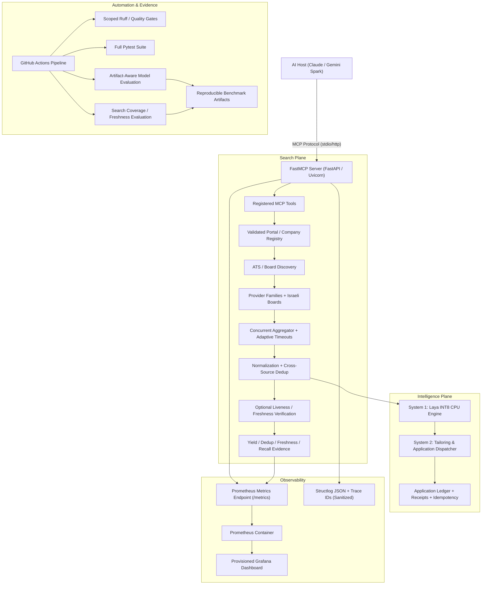

# Master Specification: TechJobMCP Production Enhancement
**Architecture, Production Hardening & Search-Quality Blueprint for Multi-Agent Collaboration (AGY, Freebuff, Pi)**

---

## 1. Context & Purpose
TechJobMCP is an asynchronous Model Context Protocol (MCP) server providing 16 autonomous tools to LLM hosts (Claude, Gemini Spark) for Israeli tech job ingestion, System 1 neural triage (fine-tuned Laya multilingual INT8 on CPU), and System 2 application dispatching across 11 current job-source/provider families.

### Core Objective:
Elevate TechJobMCP from a locally functioning prototype to an **Industry-Grade, Auditable, Search-Extensible and Evidence-Backed Production System** that demonstrates strong AI/Backend Engineering capability without unnecessary frontend bloat.

The target system must succeed on three independent axes:

1. **Production-grade:** deterministic CI, observability, reproducible benchmarks, safe deployment, and auditable application behavior.
2. **Search-extensible:** coverage must not be constrained to hardcoded company registries; supported ATS families must be extensible through configuration and discovery.
3. **Evidence-backed:** claims about model quality, search coverage, freshness, latency, reliability, and production readiness must be reproducible and publicly supportable.

### Research-Derived Strategic Findings
A read-only competitive and repository audit identified the following architectural constraints that were not fully represented in the original specification:

* The current source layer mixes whole-board, query-driven, and company-registry-driven providers. Several provider families still depend on hardcoded Python company registries.
* The aggregation, normalization, deduplication, adaptive-timeout, observability, and fail-closed application layers are stronger than the current breadth of the discovery universe.
* Adding an arbitrary company should become a configuration operation rather than a Python source-code change.
* Search coverage and search freshness are distinct quality dimensions. A broader discovery universe must not be treated as successful if stale or dead postings increase proportionally.
* Search quality itself requires measurable evidence: provider yield, deduplication rate, staleness/liveness rate, and golden-set recall.
* Productization and public evidence are part of production readiness. A technically strong local checkout is insufficient if installation, licensing, release metadata, reproducibility, and benchmark evidence are missing.
* TechJobMCP remains a **headless MCP system**. Competitor lifecycle features, dashboards, TUI/web frontends, negotiation suites, and unrelated job-search assistants are explicitly outside the core scope unless separately justified.

---

## 2. Multi-Agent Operational Rules (Strict Invariants)

All collaborating agents (AGY, Freebuff, Pi, Claude Code, Cursor) must adhere to the following rules:

1. **Do NOT Break Existing Tests:**
   - The exact repository test count is informational and evolves by milestone; it is not a contractual constant.
   - Any implementation commit MUST ensure `uv run pytest tests/` passes with zero regressions except explicitly documented expected xfails/skips.
   - Agents MUST NOT update documentation merely to match a failing test count; the test suite is the source of truth.

2. **Package & Dependency Management:**
   - The project strictly uses `uv` with `pyproject.toml` and `uv.lock`.
   - Never run raw `pip install`. Use `uv add`, `uv remove`, or `uv sync` only when dependency mutation is explicitly in scope.
   - Reproducibility policy for `uv.lock` is part of Milestone 8 and must be resolved explicitly rather than left implicit.

3. **No Unnecessary Frontends / Dashboards:**
   - TechJobMCP is a Headless MCP Server. The client is an AI host/agent.
   - Do NOT introduce web UIs, React apps, TUI dashboards, or frontend scaffolding as part of the production-enhancement roadmap.
   - Prometheus/Grafana observability remains operational infrastructure, not a product UI.

4. **Zero-Cost Local & CI Execution:**
   - All tests and benchmark validation paths must be runnable locally on CPU without requiring paid external API calls.
   - Use mocks, cached fixtures, deterministic holdouts, and public/zero-cost provider endpoints where practical.
   - Docker Compose must support single-command local spin-up.

5. **Search Coverage Must Be Configuration-Driven:**
   - Adding a supported ATS company MUST NOT require editing provider implementation code once that ATS family is supported.
   - Built-in curated defaults may exist, but user/project overrides must be loaded from a validated configuration layer.

6. **Search Coverage and Freshness Are Separate Gates:**
   - Provider breadth, job discovery recall, liveness, staleness, and repost history MUST be measured independently.
   - A provider is not considered production-ready merely because it returns results.

7. **Evidence Before Claims:**
   - Performance, quality, search-recall, freshness, and reliability claims MUST be backed by reproducible artifacts or benchmark procedures.
   - Historical or unreproduced figures must be labeled as such.

8. **No Competitor-Driven Scope Creep:**
   - Do NOT add interview coaching, negotiation, contract analysis, generalized career advice, community/plugin ecosystems, or unrelated lifecycle features unless a future specification explicitly establishes product and portfolio value.

---

## 3. Architecture Target State


```mermaid
flowchart TD
    Client["AI Host (Claude / Gemini Spark)"] -->|"MCP Protocol (stdio/http)"| Server["FastMCP Server (FastAPI / Uvicorn)"]

    subgraph Search Plane
        Server --> Tools["Registered MCP Tools"]
        Tools --> Registry["Validated Portal / Company Registry"]
        Registry --> Discovery["ATS / Board Discovery"]
        Discovery --> Sources["Provider Families + Israeli Boards"]
        Sources --> Aggregator["Concurrent Aggregator + Adaptive Timeouts"]
        Aggregator --> Normalize["Normalization + Cross-Source Dedup"]
        Normalize --> Verify["Optional Liveness / Freshness Verification"]
        Verify --> SearchMetrics["Yield / Dedup / Freshness / Recall Evidence"]
    end

    subgraph Intelligence Plane
        Normalize --> S1["System 1: Laya INT8 CPU Engine"]
        S1 --> S2["System 2: Tailoring & Application Dispatcher"]
        S2 --> Ledger["Application Ledger + Receipts + Idempotency"]
    end

    subgraph Observability
        Server --> Metrics["Prometheus Metrics Endpoint (/metrics)"]
        Server --> Logs["Structlog JSON + Trace IDs (Sanitized)"]
        SearchMetrics --> Metrics
        Metrics --> Prom["Prometheus Container"]
        Prom --> Grafana["Provisioned Grafana Dashboard"]
    end

    subgraph Automation & Evidence
        GH["GitHub Actions Pipeline"]
        GH --> Lint["Scoped Ruff / Quality Gates"]
        GH --> UnitTests["Full Pytest Suite"]
        GH --> EvalGate["Artifact-Aware Model Evaluation"]
        GH --> SearchEval["Search Coverage / Freshness Evaluation"]
        EvalGate --> BenchDocs["Reproducible Benchmark Artifacts"]
        SearchEval --> BenchDocs
    end
```

### Architectural Boundaries

* **Registry** owns user-editable company/portal configuration and validation. It does not contain scraping logic.
* **Discovery** resolves company names / career URLs into provider-compatible identifiers where possible. It does not perform ranking. Discovery may consume existing registry context, but its resolved output is reviewable data that can be persisted back as registry entries; the diagram arrow is a processing-flow simplification, not ownership direction.
* **Providers** fetch raw postings for known provider families. They remain isolated behind existing source abstractions.
* **Aggregator** owns concurrency, timeout policy, source isolation, normalization handoff, and unified result collection.
* **Verification** is an optional post-fetch stage for liveness/freshness; it must not silently mutate provider semantics.
* **System 1 / System 2** consume normalized job objects. Search-expansion work must not change model semantics unless separately specified.
* **Search evaluation** measures discovery quality separately from model-ranking quality.

---

## 4. Work Breakdown & Milestones (Specs)

### Milestone 1: Automated CI/CD & Evaluation Gates — COMPLETE

**Completion date:** 2026-09-26  
**Implementation history:** see Git history  
**Independent review:** GPT-5.6 Sol — `Merge verdict: OK`

**Verified implementation state:** Full suite: **951 passed, 2 xfailed**. Artifact-free evaluation plumbing: **5 passed, 5 skipped**. Local real-model evaluation: **8 passed, 2 xfailed**. Scoped Milestone-1 Ruff gate: **PASS**.

PR CI validates the full test suite, scoped Milestone-1 linting, and **Evaluation Framework / Plumbing Tests**. It does not download ignored Laya artifacts and does not claim real-model validation. Repository-wide Ruff findings are recorded as non-blocking technical debt, not represented as green. A pinned artifact-backed real-model regression workflow is **DEFERRED**.

#### 1.1 Evaluation Framework / Plumbing Tests [COMPLETE]

* **Target File:** `tests/evaluation/test_evaluation_gates.py`
* **Specification:**
* Before configuring the CI workflow, construct this test file.
* Artifact-independent tests cover metric plumbing, ordered match-scoring reconstruction, production seniority score capping, and complete fallback detection; they execute in clean PR CI.
* Artifact-backed diagnostics load holdout samples from `data/holdout/laya_val.jsonl` and `LazyLayaEngine` only when both ignored artifacts are locally available. Missing artifacts skip only those diagnostics.


* Real-model targets are reported honestly, not treated as passing PR-CI gates:
1. Expected Calibration Error (ECE) target $\le 3.5\%$ is currently **not met**.
2. Seniority mismatch detection accuracy target $\ge 90\%$ is currently **not met**.
3. CPU latency is measured as a regression metric. The $< 30\text{ms}$ per-pair target is **not** an accepted hard gate pending a reproducible benchmark protocol.


#### 1.2 GitHub Actions Pipeline

* **Target File:** `.github/workflows/ci.yml`
* **Specification:**
* Trigger on: `push` to `main`, `pull_request` to `main`.


* Runner: `ubuntu-latest`.


* Toolchain: Python 3.12+ via `astral-sh/setup-uv@v4`.


* **Mandatory Optimization (CPU Wheels):** Prevent downloading multi-gigabyte CUDA wheels by explicitly binding PyTorch CPU index.
* Steps:
1. Checkout repository with full history.


2. Cache uv environment (`enable-cache: true`).
3. Install dependencies with CPU PyTorch:
```bash
uv sync --extra dev --extra ml --extra training --find-links [https://download.pytorch.org/whl/cpu](https://download.pytorch.org/whl/cpu)

```


4. Install Playwright browser binary and system dependencies:
```bash
uv run playwright install --with-deps chromium

```


5. Scoped Milestone-1 code-quality check (repository-wide Ruff debt is non-blocking and recorded separately):
```bash
uv run ruff check tests/evaluation/test_evaluation_gates.py tests/conftest.py tests/test_cli_runner.py

```


6. Full Test Suite:
```bash
uv run pytest tests/ -v --tb=short

```


7. Evaluation Framework / Plumbing Tests:
```bash
uv run pytest tests/evaluation/test_evaluation_gates.py -v

```

This artifact-free PR-CI step does not claim a real-model evaluation. A pinned artifact-backed regression workflow remains deferred.


* **Verification Gate:**
* Locally verify the scoped Ruff command and run the test suite end-to-end. Do not treat artifact-free CI as proof that real-model quality targets pass.


---

### Milestone 2: Enterprise Observability & Telemetry — COMPLETE

**Completion date:** 2026-09-26
**Independent review:** GPT-5.6 Sol — `Merge verdict: OK`

**Verified implementation state:**

* `ToolMetricsMiddleware` centralizes FastMCP tool telemetry for all registered tools. It records bounded tool/status latency metrics without changing tool results or errors.
* Source-fetch latency is recorded for source attempts with bounded source labels; cache hits are excluded.
* System 1 decision counters observe the authoritative existing production scout decisions only. They record final `local_accept`, `escalate_system2`, and `disqualified` outcomes, excluding score gaps and already-applied jobs.
* `Job` keeps System 1 inference provenance private. Only real inference contributes to triage metrics; fallback, error, and synthetic paths remain distinct and are not serialized in MCP output.
* `mcp_estimated_cost_saved_usd` has zero-default semantics and increases only when configured positive savings apply to a real local acceptance.
* Prometheus is exposed through an isolated endpoint. Both `/metrics` and `/metrics/` return direct HTTP 200 Prometheus text exposition. The endpoint bypasses Gemini probe, SSE, and MCP-session semantics.
* Prometheus scrapes `techjob-mcp:8000/metrics` every 5 seconds. Docker Compose provisions a Prometheus datasource and the `TechJobMCP Overview` Grafana dashboard automatically.
* The dashboard covers tool P95/P99 latency, System 1 decision distribution, source latency, and estimated savings.

**Final verification:**

* Focused telemetry/server verification: **PASS**.
* Full test suite: **963 passed, 2 xfailed**.
* `docker compose config --quiet`: **PASS**.
* Clean baseline `uv build`: **PASS**.
* Clean Milestone-2 source-tree `uv build`: **PASS**.
* A prior developer-checkout build failure was classified as **LOCAL WORKSPACE CONTAMINATION** caused by ignored local browser-profile state; it is not a Milestone-2 packaging regression.
* Ruff for new Milestone-2 Python files and tests: **PASS**. Previously existing touched files retain legacy Ruff debt; repository-wide Ruff is not represented as green.

**Deferred:** Milestone 2 does not include Milestone 3 benchmark reproduction or model-quality work, repository-wide Ruff cleanup, Kubernetes, cloud observability, OpenTelemetry, alerting, or Milestone 4 Docker-network redesign.

---

### Milestone 3: Model Evaluation Artifacts & Benchmark Report

**Status:** COMPLETE (2026-09-30)
**Publication commit:** `docs(evaluation): publish milestone 3 benchmarks`
**Reference artifact:** `docs/benchmarks/m3-reference.json`
**Report:** `docs/BENCHMARKS.md`
**Publication harness (authoritative):** `8135c6a581527ee540c4e813769bc9862b42bde2` — `fix(evaluation): validate benchmark quality provenance`
**Benchmark schema:** `m3-benchmark-v2`

The publication manifest passed the canonical validator after a fresh CPU-only run from a clean checkout of the authoritative harness commit. It records effective dynamic INT8 quantization, exact raw lane counts with per-run separation, deterministic 16-input payload rotation with verified payload digests, artifact/config checksums, the canonical B−A quality delta, and the contaminated primary plus leakage-audited sensitivity quality views. Quality conclusions remain diagnostic only; no unbiased independent test-set estimate is claimed.

An earlier publication attempt produced under harness `1569999c76ee7db7f2052cddbf84837a3a14ca08` / schema `m3-benchmark-v1` is superseded and non-canonical; the published artifact here was regenerated from scratch at `8135c6a`.

* **Target Files / Existing Publication-Gate Implementation:**
* `docs/BENCHMARKS.md`
* `job_mcp/evaluation/benchmark.py`
* `.scripts/benchmark_milestone3.py`
* `tests/evaluation/test_benchmark_harness.py`
* `tests/evaluation/test_evaluation_gates.py`

The benchmark harness and validator are part of the publication gate and must be reconciled against the report; `docs/BENCHMARKS.md` is not independently authoritative.


* **Specification:**
* Formalize an empirical report that publishes only metrics reproduced by the benchmark harness:
1. **Dual-Engine Architecture Latency:** Reproduce cold and warm end-to-end latency under a documented benchmark protocol; treat prior figures as historical claims until reproduced.
2. **Local INT8 Quantization:** Measure throughput, latency, and memory under fixed hardware and software conditions; do not claim a latency target before measurement.
3. **Calibration & Reliability:** Reconcile training/calibration metadata with current end-to-end ECE and seniority-mismatch measurements. Document only reproduced holdout results.

* Provide exact CLI reproduction commands and the benchmark environment definition.


---

### Milestone 4: Docker Compose Verification & Healthcheck

* **Target Files:**
* `docker-compose.yml`


* **Specification:**
* Ensure all Docker Compose services participate in the intended topology and dependency graph. The current topology includes `techjob-mcp`, `prometheus`, `grafana`, `ollama`, and the `ollama-model-pull` helper/service; verification must include the Ollama healthcheck/model-pull dependency rather than checking only the three observability/application services.


* `techjob-mcp` maintains its internal environment configuration:
* `SOURCE_TIMEOUT_SECONDS=15.0`

* `ENABLE_INT8_QUANTIZATION=true`

* `MAX_NEURAL_EVAL=15`

* `TORCH_NUM_THREADS=4`


* **Verification Gate:**
* Execute `docker compose config` to verify syntax and volume mounts.


---

### Milestone 5: Open Search Registry & Provider Extensibility

**Objective:** Convert supported company coverage from hardcoded implementation data into a validated, configuration-driven search registry without changing provider semantics.

**Primary Target Areas:**
* New validated registry/config module.
* User/project configuration such as `portals.yml` or an equivalent typed format.
* Existing company-driven providers that already expose `companies=` or equivalent constructor seams.
* Configuration validation tests and deterministic merge behavior.

**Specification:**
1. Built-in curated defaults remain supported for zero-config startup.
2. User/project configuration can add, override, enable, or disable companies without modifying provider implementation code.
3. The initial configuration format is a validated YAML registry (for example `portals.yml`) parsed into typed models before provider construction. Equivalent formats may be introduced later only through the same typed registry boundary.
4. Registry entries are typed and validated before network execution.
5. Unknown fields, malformed provider identifiers, duplicate conflicting entries, and invalid URLs fail clearly.
6. Configuration merge precedence is deterministic and documented.
7. Configuration is loaded when the source/provider registry is constructed. Reloading requires an explicit tested entry point; implicit filesystem hot-reload is a non-goal.
8. No provider implementation may read ad-hoc YAML/JSON directly; providers receive normalized typed configuration from the registry layer.
9. Existing source enable/disable environment flags remain backward-compatible unless explicitly deprecated.
10. Provider-specific query defaults that materially narrow coverage (including the current DirectTech default query behavior) must be representable as registry-level configuration and must be documented; hidden hardcoded narrowing is not permitted.

**Acceptance Criteria:**
* A user can add at least one new Greenhouse company and one new Lever company using configuration only.
* At least three existing company-driven provider families consume the same registry abstraction.
* Adding those companies produces zero Python provider diffs.
* Invalid configuration is rejected before fetch execution with actionable diagnostics.
* Provider-specific default queries that materially narrow coverage can be explicitly overridden through the registry and are covered by tests.
* Full existing test suite passes.
* Scoped lint/type/format gates for all new files pass.
* No System 1, System 2, application-dispatch, SSE/MCP-session, or observability regression.

**Non-Goals:**
* No new ATS family is required by this milestone.
* No generic web crawling fallback.
* No liveness verification.
* No UI/config editor.
* No community plugin registry.

---

### Milestone 6: ATS Discovery & Coverage Expansion

**Objective:** Move from known-company scanning toward open-ended discovery by adding high-value ATS families and deterministic board/company resolution.

**Initial Provider Priority:**
1. Ashby
2. SmartRecruiters
3. Workable

Priority may be revised only from evidence about Israeli / AI-market coverage.

**Definition — Supported ATS Family:**
An ATS family counts as supported only when it:
* implements the existing source/provider contract,
* accepts registry-supplied identifiers rather than hardcoded company lists,
* emits normalized `Job` models compatible with existing deduplication,
* exposes a health-check path consistent with the source abstraction where applicable,
* and has deterministic fixture-backed or mocked-transport tests suitable for zero-cost CI.

**Internal Delivery Order:**

#### M6a — Parametric ATS Providers
Implement and validate the new ATS provider families first.

#### M6b — Deterministic Company / Board Discovery
Build discovery only after the target provider contracts are stable. M6b is a separately gated sub-deliverable and must not block acceptance of an otherwise complete provider implementation during development.

**Specification:**
1. New provider families follow the existing public-source abstraction and normalization contracts.
2. Each supported ATS must accept registry-supplied company/board identifiers rather than hardcoded company lists.
3. Add a discovery capability such as `discover_companies` that accepts company names and/or career URLs and attempts deterministic provider resolution.
4. Discovery should prefer zero-token/public mechanisms: URL patterns, redirects, public metadata, documented JSON endpoints, and provider fingerprints.
5. Unsupported or ambiguous companies must return explicit structured diagnostics rather than silently disappearing.
6. Discovery results must be representable as registry entries and reviewable before persistence.
7. LLM inference is not required for the default discovery path.
8. Discovery validation uses a named, versioned fixture set covering successful, ambiguous, unsupported, and malformed cases.

**Acceptance Criteria:**
* At least three ATS families satisfy the Supported ATS Family definition above.
* At least one company per new ATS can be added via configuration and fetched successfully under deterministic mocked-transport or recorded-fixture tests, with zero provider-code modification for that company.
* Optional live-network verification may be documented separately as a non-gating manual check; it is never required for CI success.
* `discover_companies` resolves the named supported fixture set into valid registry entries.
* Ambiguous and unsupported fixture cases return explicit structured diagnostics.
* Existing normalization/deduplication contracts remain unchanged.
* Full test suite and scoped quality gates pass.

**Non-Goals:**
* No broad arbitrary-web crawler.
* No paid search API dependency.
* No ranking-model retraining.
* No lifecycle features unrelated to search discovery.

---

### Milestone 7: Verified Freshness & Search Quality Evidence

**Objective:** Ensure broader search coverage produces trustworthy, current postings and publish measurable search-quality evidence.

**Primary Capabilities:**
* Posting observation identity/history.
* Search-quality metrics.
* Optional liveness verification.
* Repost detection substrate.
* Golden-set search recall benchmark.

**Required Internal Order:**
1. Canonical identity policy and observation-store schema.
2. Persistence, retention/pruning, and migration policy.
3. Search-quality metrics.
4. Optional liveness verification.
5. Golden-set search benchmark and longitudinal/repost scenarios.

**Specification:**
1. Introduce a posting-observation record distinct from the application ledger.
2. Define and document a canonical job identity before implementing the observation store. The minimum identity policy must combine normalized company, normalized title, and an explicit normalized-location policy; canonical/raw URLs are retained as secondary evidence rather than treated as the sole identity.
3. Identity stability and intentional identity change under title/location edits must be covered by tests. The policy must explicitly document which edits preserve identity and which create a new observation lineage.
4. Preserve first-seen, last-seen, provider, canonical/raw URL evidence, canonical identity, and verification status sufficient for longitudinal analysis.
5. Define observation-store retention/pruning and schema-migration behavior before publication claims depend on longitudinal history.
6. Add an optional liveness verification stage for returned postings using the least expensive reliable mechanism available; Playwright may be used when simpler checks are insufficient.
7. Verification outcomes must distinguish dead/expired, temporarily unreachable, blocked/rate-limited, and unknown outcomes where technically possible.
8. Repost detection must be based on historical observation evidence and the canonical identity policy, not title-only or raw-URL-only heuristics.
9. Export bounded-label metrics such as:
   * jobs discovered per source,
   * post-dedup yield,
   * liveness/staleness rate,
   * verification latency/error class,
   * time-to-first-seen where source timestamps permit.
10. Create a reproducible golden-set search benchmark for known-open roles/providers.
11. Search recall/freshness claims must state corpus, observation window, provider scope, and known limitations.
12. All CI-facing liveness/search-quality validation must use deterministic fixtures or mocked transport. Live-network checks, if performed, are non-gating manual evidence.

**Acceptance Criteria:**
* Observation history persists independently of application state.
* Canonical identity behavior is covered by tests for stable, edited, and genuinely distinct postings.
* Retention/pruning and migration behavior are documented and tested at the schema/service boundary.
* Liveness verification can be enabled/disabled without changing baseline provider fetching.
* Stale/dead outcomes are measurable and tested through deterministic fixtures/mocks.
* At least one repost/history scenario is reproducibly detected using the canonical identity policy.
* `/metrics` exposes bounded search-quality metrics.
* A documented golden-set search benchmark is reproducible from a fixed fixture or explicitly versioned reference set.
* Full test suite and scoped quality gates pass.

**Non-Goals:**
* No claim of universal ghost-job detection.
* No opaque LLM-based scam classifier unless separately evaluated.
* No provider blocking/circumvention mechanisms.
* No change to model-quality benchmarks from Milestone 3.

---

### Milestone 8: OSS Productization & Public Evidence Surface

**Objective:** Make the public repository faithfully represent the engineering quality of the working system and reduce setup friction without changing the headless MCP product boundary.

**Primary Areas:**
* License and repository hygiene.
* Reproducible dependency policy.
* Release/versioning workflow.
* Installation / first-run diagnostics.
* Benchmark and architecture evidence.
* Minimal contribution surface.

**Specification:**
1. Add an explicit project license selected by the repository owner.
2. Resolve and document the tracking policy for `uv.lock`, `AGENTS.md`, and other currently untracked source-of-truth project files. The production-enhancement SPEC itself is already tracked and remains authoritative once validated.
3. Ensure README claims are generated from or reconciled against current verified state; avoid hardcoded test-count claims that immediately drift.
4. Publish completed benchmark evidence from Milestone 3 and search-quality evidence from Milestone 7.
5. Add a short first-run/Quickstart path that minimizes required conceptual setup.
6. Add a `doctor`-style diagnostic command or equivalent health check for local prerequisites, model/artifact availability, browser requirements, and MCP connectivity.
7. Establish semantic release/tag/changelog discipline.
8. Add minimal contribution guidance for registry/provider additions.
9. Screenshots or terminal captures may document usage, but no product frontend is introduced.

**Acceptance Criteria:**
* Repository has a valid license.
* Reproducibility policy for lock/spec/agent files is explicit and enforced.
* A clean clone can reach a deterministic first useful result through the documented Quickstart. For this milestone, "first useful result" means the project diagnostic/doctor path succeeds under documented prerequisites and at least one read-only MCP/source-listing operation returns the expected configured source inventory without requiring application submission.
* Diagnostic tooling identifies common setup failures before runtime execution where possible.
* Release/tag/changelog process is documented and exercised at least once.
* Public benchmark/evidence documents match current reproducible artifacts.
* README contains no known stale test-count or capability claims.
* Full test suite and scoped quality gates pass.

**Non-Goals:**
* No TUI/web dashboard.
* No large plugin ecosystem.
* No multi-CLI duplication of the full implementation.
* No interview/negotiation/career-coaching suite.
* Publishing to PyPI / `uvx` distribution is intentionally deferred from M8 unless separately approved after repository hygiene and release discipline are complete.

---

### Strategic Sequencing Rule

The research-derived milestones do **not** supersede unfinished production-hardening work.

Required order:

1. Complete Milestone 3 benchmark publication honestly.
2. Complete Milestone 4 Docker Compose verification/healthcheck.
3. Execute Milestone 5 before broad provider expansion.
4. Execute Milestone 6 before claiming materially open-ended discovery.
5. Execute Milestone 7 before making freshness/search-quality claims.
6. Execute Milestone 8 as a bounded productization/evidence workstream. Trivial hygiene fixes may occur earlier only when they do not disturb active milestone work; explicitly permitted examples include adding the repository LICENSE and reconciling stale documentation claims such as test-count text.

The roadmap must not use competitor feature count as a success metric. Success is measured by reproducibility, search coverage, search freshness, user setup friction, and public evidence.


---

## 5. Agent Verification Checklist (Definition of Done)

Before any agent marks a milestone or task as complete, it MUST verify:

* [ ] `uv run pytest tests/` passes with no unexpected failures. The exact pass count is recorded as evidence, not treated as a permanent contract.
* [ ] Expected xfails/skips are explained and remain intentional.
* [ ] Scoped Ruff/quality gates for all new or materially changed files pass.
* [ ] `git diff --check` passes.
* [ ] No milestone claims success based on documentation alone when executable verification is available.
* [ ] Any benchmark/report claim is reproducible from documented commands, artifacts, corpus/version information, and environment constraints.
* [ ] Search coverage changes distinguish provider-family support, configured-company count, query-driven discovery, and whole-board coverage.
* [ ] Search-quality changes distinguish recall/coverage from liveness/freshness and from ranking/model quality.
* [ ] Configuration-driven provider changes preserve backward compatibility or document migration explicitly.
* [ ] New network/provider functionality has deterministic mocked/fixture-backed tests suitable for zero-cost CI.
* [ ] No new frontend/TUI/lifecycle scope was introduced without an explicit specification revision.
* [ ] Dependency mutations use `uv`; raw `pip install` is prohibited.
* [ ] Git commit message follows Conventional Commits format (`ci:`, `feat:`, `fix:`, `docs:`, `test:`, `refactor:` as appropriate).

### Historical / Milestone-Specific Gates

* [ ] For Milestone 1 PR CI, artifact-free evaluation/plumbing tests pass; artifact-backed real-model diagnostics are separately reported or explicitly skipped when artifacts are unavailable.
* [ ] For Milestone 1 PR CI, the scoped Milestone-1 Ruff gate passes. Repository-wide Ruff debt is recorded separately and is not represented as green.
* [x] Milestone 2 `/metrics` is isolated and does not interfere with FastMCP SSE, Gemini probe, or MCP-session requests; both `/metrics` and `/metrics/` return direct HTTP 200 Prometheus text.
* [x] Milestone 2 `docker compose config --quiet` evaluates without warnings or schema errors.
* [x] Milestone 3 publishes only benchmark results validated by the canonical benchmark harness and publication validator.
* [ ] Milestone 4 verifies the final Docker Compose topology/health behavior.
* [ ] Milestone 5 proves supported-company additions can occur through configuration only.
* [ ] Milestone 6 proves discovery/provider expansion without provider-code edits for each configured company.
* [ ] Milestone 7 publishes search-quality/freshness evidence with explicit corpus and observation-window limitations.
* [ ] Milestone 8 confirms public repository metadata and documentation match reproducible project state.

---

## 6. Explicit Portfolio / Product Boundaries

This specification optimizes for a technically credible **AI Engineer / AI Backend Engineer portfolio system**, not for maximum feature count.

The following are considered high-signal capabilities:

* reproducible model evaluation,
* search coverage architecture,
* deterministic provider extensibility,
* retrieval/search quality measurement,
* resilient async orchestration,
* observability,
* auditability and receipts,
* configuration validation,
* safe automation,
* packaging/release reproducibility.

The following are low-priority unless future evidence changes the decision:

* interview coaching,
* negotiation assistants,
* generic career advice,
* offer/contract analysis,
* dashboards unrelated to operations,
* community/plugin marketplaces,
* large global hardcoded company catalogs.

Any future proposal that expands into these areas must demonstrate a measurable product need and portfolio value before entering the implementation roadmap.